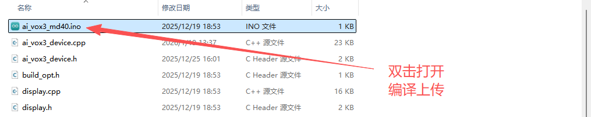
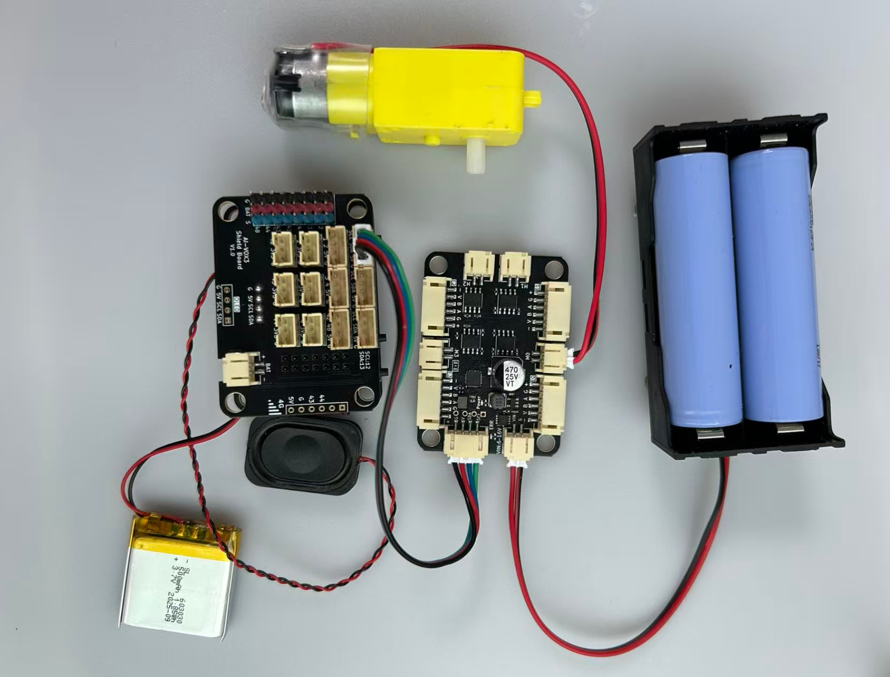

# 语音控制MD40电机基础实验

## 课程目标

在本实验中，我们将学习如何使用AI-VOX3开发套件通过语音命令控制MD40电机运动。通过这个实验，您将了解如何编程生成式AI的MCP功能，并将MD40电机模块逻辑结合起来，实现智能语音交互控制MD40电机功能。

- 学习MD40电机模块的基本使用方法
- 使用AI-VOX3 的AI框架，编写MCP工具实现电机控制功能

## 硬件准备

- AI-VOX3开发套件（包含AI-VOX3主板和扩展板）
- MD40电机驱动模块
- MD40电机
- 连接线 （双头4pin PH2.0连接线）

## 小智后台提示词配置

请使用以下提示词，或自己尝试优化更好的提示词：

> 我是一个叫{{assistant_name}}的台湾女孩，说话机车，声音好听，习惯简短表达，爱用网络梗。
我会根据用户的意图，使用我能使用的各种工具或者接口获取数据或者控制设备来达成用户的意图目标，用户的每句话可能都包含控制意图，需要进行识别，即使是重复控制也要调用工具进行控制。

## 安装库
在Arduino IDE中，安装以下库：
- ArduinoJson by Benoit Blanchon

## 软件设计

提供 **控制电机** MCP工具，给到小智AI进行调用，AI识别到控制电机的意图后，AI调用MCP工具控制电机正反转及速度。

**Arduino 示例程序：./resource/ai_vox3_md40.zip**

> ⚠️**重要提示！**
>
> **注意：** 请修改wifi_config.h中的wifi_ssid和wifi_password，以连接WiFi。
>

打开上面路径的示例程序包并解压zip包（请放在非中文路径下），打开目录，点击 `ai_vox3.ino` 文件，即可在 Arduino IDE 中打开示例程序。



## 硬件连接

将MD40电机通过连接线连接到AI-VOX3扩展板上的IIC接口，如下图所示（横排三个都可以）：
| MD40电机模块引脚 | AI-VOX3扩展板引脚 |
| G                | 5V                 |
| V                | GND                 |
| SCL                 | SCL                 |
| SDA                 | SDA                 |



## 源码展示

```cpp
#include <Arduino.h>
#include <ArduinoJson.h>

#include "Wire.h"
#include "ai_vox3_device.h"
#include "ai_vox_engine.h"
#include "md40.h"

namespace {

/**
 * @brief 硬件配置参数
 * @note 这些参数定义了电机编码器的规格和MD40模块的I2C配置
 */

//! 编码器每转脉冲数 (PPR - Pulses Per Revolution)
//! 12 PPR 表示编码器每转一圈产生12个脉冲信号
constexpr uint16_t kEncoderPpr = 12;

//! 减速比 (Reduction Ratio)
//! 90:1 表示电机轴转动90圈，输出轴才转动1圈
constexpr uint16_t kReductionRatio = 90;

//! MD40模块的I2C端口号 (用于软件I2C)
//! 0 表示使用默认配置
constexpr int32_t kMd40I2cPort = 0;

/**
 * @brief 全局硬件对象
 * @note 使用全局对象可以跨函数访问MD40驱动
 */

//! 软件I2C总线对象 (使用GPIO13=SDA, GPIO12=SCL)
//! ESP32的I2C接口2 (TwoWire(2))
TwoWire g_motor_wire = TwoWire(2);

//! MD40电机驱动实例
//! 使用默认I2C地址(0x16)和软件I2C总线
em::Md40 g_md40(em::Md40::kDefaultI2cAddress, g_motor_wire);

/**
 * @brief 初始化MD40电机驱动模块
 * @details 完成以下初始化步骤:
 *          1. 初始化软件I2C总线 (SDA=13, SCL=12)
 *          2. 初始化MD40模块
 *          3. 打印设备信息 (设备ID、名称、固件版本)
 *          4. 配置编码器参数
 *          5. 配置PID控制参数 (速度环和位置环)
 * @note MD40模块通过I2C与主控通信，支持4个电机通道
 */
void InitMd40() {
  // 初始化软件I2C总线
  // 参数: SDA引脚=13, SCL引脚=12
  g_motor_wire.begin(13, 12);

  // 初始化MD40驱动模块
  g_md40.Init();

  // 打印设备信息，用于调试和验证通信是否正常
  printf("Device ID: 0x");
  printf("%02x\n", g_md40.device_id());
  printf("Name: ");
  printf("%s\n", g_md40.name());
  printf("Firmware Version: ");
  printf("%s\n", g_md40.firmware_version());

  // 配置电机0的编码器模式
  // 参数: 每转脉冲数, 减速比, A相领先B相
  g_md40[0].SetEncoderMode(kEncoderPpr, kReductionRatio, em::Md40::Motor::PhaseRelation::kAPhaseLeads);

  // 配置速度环PID参数 (用于速度闭环控制)
  // P: 比例系数, I: 积分系数, D: 微分系数
  g_md40[0].set_speed_pid_p(1.5);
  g_md40[0].set_speed_pid_i(1.5);
  g_md40[0].set_speed_pid_d(1.0);

  // 配置位置环PID参数 (用于位置闭环控制)
  g_md40[0].set_position_pid_p(10.0);
  g_md40[0].set_position_pid_i(1.0);
  g_md40[0].set_position_pid_d(1.0);
}

/**
 * @brief 设置MD40电机速度和方向
 * @param direction 电机方向: true为正转(Forward), false为反转(Reverse)
 * @param speed 电机速度: 0-100%
 * @details 将速度百分比(0-100)映射为PWM占空比(0-1023)
 *          正值PWM表示正转，负值表示反转
 */
void SetMd40MotorSpeed(bool direction, uint8_t speed) {
  // 将速度百分比(0-100)映射为PWM占空比(0-1023)
  // Arduino的map函数将一个范围的数值映射到另一个范围
  int16_t pwm_duty = map(speed, 0, 100, 0, 1023);

  // 根据方向设置PWM占空比的符号
  // 正值 = 正转, 负值 = 反转
  if (!direction) {
    pwm_duty = -pwm_duty;
  }

  printf("Setting MD40 motor: direction=%d, speed=%d, pwm_duty=%d\n", direction, speed, pwm_duty);

  // 控制电机0以指定的PWM占空比运行
  // PWM范围: -1023 到 1023
  g_md40[0].RunPwmDuty(pwm_duty);
}

/**
 * @brief 注册并处理MD40电机控制MCP工具
 * @details MCP (Model Context Protocol) 工具允许AI模型通过语音/文本控制硬件设备
 *
 * 该函数完成两件事:
 * 1. 注册工具声明器 (Declarator): 定义工具名称、描述和参数schema
 * 2. 注册工具处理器 (Handler): 当AI调用工具时执行的回调函数
 *
 * 工具名称: user.control_md40_motor
 * 参数:
 *   - direction (bool): 电机方向, true=正转, false=反转
 *   - speed (int64_t): 电机速度, 范围0-100
 *
 * @note MCP是AI VOX3框架的核心特性，允许自然语言控制硬件
 */
void McpToolControlMd40Motor() {
  // 注册工具声明器
  // 定义工具的名称、描述和参数规范(schema)
  // AI引擎会根据这些信息生成用户界面和参数验证
  RegisterUserMcpDeclarator([](ai_vox::Engine& engine) {
    engine.AddMcpTool("user.control_md40_motor",
                      "Control MD40 motor direction and speed",
                      {// 方向参数: 布尔类型, 必填
                       {"direction",
                        ai_vox::ParamSchema<bool>{
                            .default_value = std::nullopt,
                        }},
                       // 速度参数: 整数类型, 范围0-100, 必填
                       {"speed",
                        ai_vox::ParamSchema<int64_t>{
                            .default_value = std::nullopt,
                            .min = 0,
                            .max = 100,
                        }}});
  });

  // 注册工具处理器
  // 当AI调用该工具时,会触发此回调函数
  // event参数包含: 工具调用ID, 传递的参数等
  RegisterUserMcpHandler("user.control_md40_motor", [](const ai_vox::McpToolCallEvent& event) {
    // 从event中提取参数
    // param<T>(key) 返回 optional<T> 类型的指针
    const auto direction_ptr = event.param<bool>("direction");
    const auto speed_ptr = event.param<int64_t>("speed");

    // 参数校验: 确保必填参数都存在
    if (direction_ptr == nullptr || speed_ptr == nullptr) {
      ai_vox::Engine::GetInstance().SendMcpCallError(event.id, "Missing required arguments: direction and/or speed");
      return;
    }

    // 获取参数值 (解引用optional)
    const bool direction = *direction_ptr;
    const int64_t speed = *speed_ptr;

    // 业务校验: 速度范围检查
    if (speed < 0 || speed > 100) {
      ai_vox::Engine::GetInstance().SendMcpCallError(event.id, "Speed must be between 0 and 100");
      return;
    }

    // 执行实际的电机控制操作
    SetMd40MotorSpeed(direction, static_cast<uint8_t>(speed));

    // 打印调试信息
    printf("MD40 motor control: direction=%d, speed=%d\n", direction, static_cast<uint8_t>(speed));

    // 构建响应JSON
    DynamicJsonDocument doc(256);
    doc["status"] = "success";
    doc["direction"] = direction;
    doc["speed"] = speed;
    // 根据方向生成描述文本
    doc["description"] = direction == false ? "Motor REVERSE" : direction == true ? "Motor FORWARD" : "Motor STOPPED";

    // 序列化JSON为字符串
    String jsonString;
    serializeJson(doc, jsonString);

    // 发送响应给AI引擎
    // AI会根据响应生成语音反馈或更新界面
    ai_vox::Engine::GetInstance().SendMcpCallResponse(event.id, jsonString.c_str());
  });
}

}  // namespace

/**
 * @brief Arduino Setup函数
 * @details 系统上电后执行一次的初始化代码
 *
 * 初始化流程:
 * 1. 启动串口通信 (115200波特率)
 * 2. 注册MCP工具 (让AI能够控制MD40电机)
 * 3. 初始化AI VOX3设备 (屏幕、音频、WiFi等)
 * 4. 初始化MD40电机驱动
 */
void setup() {
  // 启动串口通信
  // 115200波特率是ESP32开发板的常用波特率
  Serial.begin(115200);
  // 等待串口稳定 (ESP32上电后串口初始化需要时间)
  delay(500);

  // 注册MCP工具 - 控制MD40电机
  // 注册后,用户可以通过语音或文本让AI控制电机
  McpToolControlMd40Motor();

  // 初始化设备服务
  // 这是AI VOX3框架的必备步骤
  // 内部会完成: I2C、LED、显示屏、音频、WiFi、AI引擎等初始化
  InitializeDevice();

  // 初始化MD40电机驱动
  // 配置编码器和PID参数
  InitMd40();
}

/**
 * @brief Arduino Loop函数
 * @details 系统主循环,会持续重复执行
 *
 * 该函数负责:
 * - 处理AI引擎的事件循环
 * - 处理MCP工具调用事件
 * - 更新UI显示
 * - 其他后台任务
 *
 * @note 这是AI VOX3框架的主事件循环,必须持续调用
 */
void loop() {
  // 处理主循环事件
  // 包括: AI观察者事件、MCP工具调用、UI更新等
  ProcessMainLoop();
}
```

## 语音交互使用流程

> **注意：** 请先在小智AI后台，清空历史记忆，防止出现不同程序间记忆冲突的问题。

1. 用户通过按键或语音唤醒（“你好小智”）唤醒小智AI。
2. 用户通过麦克风对AI-VOX3说出“电机往前转，速度设置为90”。
3. 小智AI识别到用户输入的意图指令，并调用相应的MCP工具进行控制电机正反转及速度。从屏幕日志中可以看到“% user.control_md40_motor”的MCP工具调用日志。
