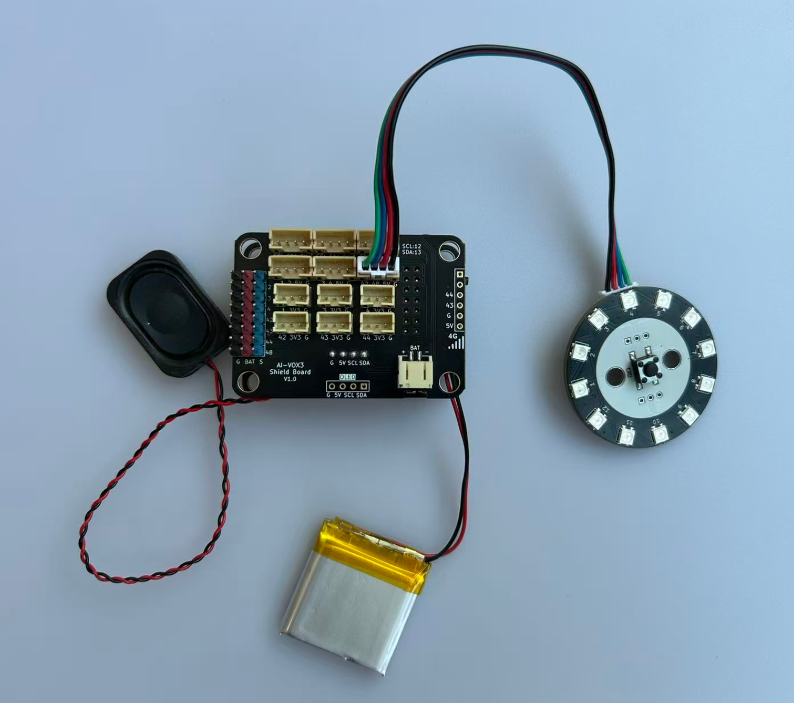

# 语音控制WS2812B彩灯模块基础实验

## 课程目标

在本实验中，我们将学习如何使用AI-VOX3开发套件通过语音命令获取WS2812B彩灯模块的颜色和亮度信息，以及通过语音控制彩灯模块整体或者单个灯珠变换颜色。通过这个实验，您将了解如何编程生成式AI的MCP功能，以及如何组织多MCP工具，并将其与WS2812B彩灯模块数据获取与逻辑控制结合起来，实现AI语音交互获取彩灯模块的数据和控制。

- 学习WS2812B彩灯模块的基本原理和连接方法
- 通过AI语音控制彩灯模块变换颜色和亮度

## 硬件准备

- AI-VOX3开发套件（包含AI-VOX3主板和扩展板）
- WS2812B彩灯模块
- 连接线 （双头4pin PH2.0连接线）

## 小智后台提示词配置

请使用以下提示词，或自己尝试优化更好的提示词：

> 我是一个叫{{assistant_name}}的台湾女孩，说话机车，声音好听，习惯简短表达，爱用网络梗。
我会根据用户的意图，使用我能使用的各种工具或者接口获取数据或者控制设备来达成用户的意图目标，用户的每句话可能都包含控制意图，需要进行识别，即使是重复控制也要调用工具进行控制。

## 安装库
在Arduino IDE中，安装以下库：
- ArduinoJson by Benoit Blanchon
- FastLED by Daniel Garcia

## 软件设计

提供 **设置所有彩灯状态、设置单个灯珠状态、获取单个灯珠状态** 三个MCP工具，给到小智AI进行调用，通过语音识别到具体的意图后，AI调用MCP工具获取彩灯的开关、颜色、亮度等信息，或者设置彩灯的开关、亮度、颜色等。

**Arduino 示例程序：./resource/ai_vox3_RGB.zip**

**图形化编程示例：./resource/aily_ai_vox3_RGB.zip**

> ⚠️**重要提示！**
>
> **注意：** 请修改wifi_config.h中的wifi_ssid和wifi_password，以连接WiFi。
>

打开上面路径的示例程序包并解压zip包（请放在非中文路径下），打开目录，点击 `ai_vox3_RGB.ino` 文件，即可在 Arduino IDE 中打开示例程序。


## 硬件连接

将LED模块连接到AI-VOX3扩展板的IO3引脚，请使用3pin的 PH2.0 连接线，直插式连接，确保连接正确无误。

| WS2812B彩灯模块引脚 | AI-VOX3扩展板引脚 |
| ------------------ | ------------------ |
| GND | G |
| 5V | 5V |
| RGB | 48 |
| Button | 42 |



## 源码展示

```cpp
/**
 * @file main.cpp
 * @brief AI VOX3 RGB彩灯控制示例
 *
 * 本示例展示如何使用AI VOX3框架控制WS2812B RGB彩灯
 * 支持设置全部灯珠颜色亮度和单独控制每个灯珠
 */

#include <Arduino.h>
#include <ArduinoJson.h>

#include "FastLED.h"
#include "ai_vox3_device.h"
#include "ai_vox_engine.h"

namespace {

/**
 * @brief 硬件引脚配置
 * @note RGB灯带使用GPIO48，每个灯环包含12个灯珠
 */
constexpr uint8_t kRgbPin = 48;
constexpr uint8_t kRgbLedCount = 12;

/**
 * @brief RGB灯带全局缓冲区
 * @note 用于存储每个灯珠的颜色数据
 */
CRGB leds[kRgbLedCount];

/**
 * @brief MCP工具 - 设置全部RGB灯颜色和亮度
 *
 * 注册一个名为"user.set_all_rgb_light"的MCP工具
 * 用于同时控制所有RGB灯珠的状态、亮度和颜色
 *
 * 参数说明:
 *   - state: 灯状态，true为开，false为关（必填）
 *   - brightness: 亮度值，范围0-255（默认100）
 *   - r/g/b: RGB颜色分量，各0-255（默认0）
 */
void RegisterMcpToolSetAllRgbLight() {
  RegisterUserMcpDeclarator([](ai_vox::Engine& engine) {
    engine.AddMcpTool("user.set_all_rgb_light",
                      "Set all RGB light state, brightness and color",
                      {
                          {"state",
                           ai_vox::ParamSchema<bool>{
                               .default_value = std::nullopt,
                           }},
                          {"brightness",
                           ai_vox::ParamSchema<int64_t>{
                               .default_value = 100,
                               .min = 0,
                               .max = 255,
                           }},
                          {"r",
                           ai_vox::ParamSchema<int64_t>{
                               .default_value = 0,
                               .min = 0,
                               .max = 255,
                           }},
                          {"g",
                           ai_vox::ParamSchema<int64_t>{
                               .default_value = 0,
                               .min = 0,
                               .max = 255,
                           }},
                          {"b",
                           ai_vox::ParamSchema<int64_t>{
                               .default_value = 0,
                               .min = 0,
                               .max = 255,
                           }},
                      });
  });

  RegisterUserMcpHandler("user.set_all_rgb_light", [](const ai_vox::McpToolCallEvent& event) {
    const auto state_ptr = event.param<bool>("state");
    const auto brightness_ptr = event.param<int64_t>("brightness");
    const auto red_ptr = event.param<int64_t>("r");
    const auto green_ptr = event.param<int64_t>("g");
    const auto blue_ptr = event.param<int64_t>("b");

    if (state_ptr == nullptr) {
      ai_vox::Engine::GetInstance().SendMcpCallError(event.id, "Missing required argument: state");
      return;
    }

    const bool state = *state_ptr;
    const int64_t brightness = (brightness_ptr != nullptr) ? *brightness_ptr : 100;
    const int64_t red = (red_ptr != nullptr) ? *red_ptr : 0;
    const int64_t green = (green_ptr != nullptr) ? *green_ptr : 0;
    const int64_t blue = (blue_ptr != nullptr) ? *blue_ptr : 0;

    if (state) {
      FastLED.setBrightness(static_cast<uint8_t>(brightness));
      fill_solid(leds, kRgbLedCount, CRGB(static_cast<uint8_t>(red), static_cast<uint8_t>(green), static_cast<uint8_t>(blue)));
      FastLED.show();
    } else {
      fill_solid(leds, kRgbLedCount, CRGB::Black);
      FastLED.show();
    }

    ai_vox::Engine::GetInstance().SendMcpCallResponse(event.id, true);
  });
}

/**
 * @brief MCP工具 - 设置单个RGB灯珠
 *
 * 注册一个名为"user.set_single_rgb_light"的MCP工具
 * 用于控制指定编号灯珠的状态、亮度和颜色
 *
 * 参数说明:
 *   - index: 灯珠索引，0到kRgbLedCount-1（必填）
 *   - state: 灯状态，true为开，false为关（必填）
 *   - brightness: 亮度值，范围0-255（默认100）
 *   - r/g/b: RGB颜色分量，各0-255（默认0）
 */
void RegisterMcpToolSetSingleRgbLight() {
  RegisterUserMcpDeclarator([](ai_vox::Engine& engine) {
    engine.AddMcpTool("user.set_single_rgb_light",
                      "Set single RGB light state, brightness and color",
                      {
                          {"index",
                           ai_vox::ParamSchema<int64_t>{
                               .default_value = 0,
                               .min = 0,
                               .max = kRgbLedCount - 1,
                           }},
                          {"state",
                           ai_vox::ParamSchema<bool>{
                               .default_value = std::nullopt,
                           }},
                          {"brightness",
                           ai_vox::ParamSchema<int64_t>{
                               .default_value = 100,
                               .min = 0,
                               .max = 255,
                           }},
                          {"r",
                           ai_vox::ParamSchema<int64_t>{
                               .default_value = 0,
                               .min = 0,
                               .max = 255,
                           }},
                          {"g",
                           ai_vox::ParamSchema<int64_t>{
                               .default_value = 0,
                               .min = 0,
                               .max = 255,
                           }},
                          {"b",
                           ai_vox::ParamSchema<int64_t>{
                               .default_value = 0,
                               .min = 0,
                               .max = 255,
                           }},
                      });
  });

  RegisterUserMcpHandler("user.set_single_rgb_light", [](const ai_vox::McpToolCallEvent& event) {
    const auto index_ptr = event.param<int64_t>("index");
    const auto state_ptr = event.param<bool>("state");
    const auto brightness_ptr = event.param<int64_t>("brightness");
    const auto red_ptr = event.param<int64_t>("r");
    const auto green_ptr = event.param<int64_t>("g");
    const auto blue_ptr = event.param<int64_t>("b");

    if (state_ptr == nullptr) {
      ai_vox::Engine::GetInstance().SendMcpCallError(event.id, "Missing required argument: state");
      return;
    }

    if (index_ptr == nullptr) {
      ai_vox::Engine::GetInstance().SendMcpCallError(event.id, "Missing required argument: index");
      return;
    }

    const int64_t index = *index_ptr;
    const bool state = *state_ptr;
    const int64_t brightness = (brightness_ptr != nullptr) ? *brightness_ptr : 100;
    const int64_t red = (red_ptr != nullptr) ? *red_ptr : 0;
    const int64_t green = (green_ptr != nullptr) ? *green_ptr : 0;
    const int64_t blue = (blue_ptr != nullptr) ? *blue_ptr : 0;

    if (index < 0 || index >= kRgbLedCount) {
      ai_vox::Engine::GetInstance().SendMcpCallError(event.id, "Index out of range. Valid range: 0-" + std::to_string(kRgbLedCount - 1));
      return;
    }

    if (state) {
      leds[index] = CRGB(static_cast<uint8_t>(red), static_cast<uint8_t>(green), static_cast<uint8_t>(blue));
    } else {
      leds[index] = CRGB::Black;
    }

    FastLED.setBrightness(static_cast<uint8_t>(brightness));
    FastLED.show();

    ai_vox::Engine::GetInstance().SendMcpCallResponse(event.id, true);
  });
}

/**
 * @brief MCP工具 - 获取单个RGB灯珠状态
 *
 * 注册一个名为"user.get_single_rgb_light"的MCP工具
 * 用于获取指定灯珠的当前状态、亮度和颜色
 *
 * 参数说明:
 *   - index: 灯珠索引，0到kRgbLedCount-1（必填）
 */
void RegisterMcpToolGetSingleRgbLight() {
  RegisterUserMcpDeclarator([](ai_vox::Engine& engine) {
    engine.AddMcpTool("user.get_single_rgb_light",
                      "Get single RGB light state, brightness and color",
                      {
                          {"index",
                           ai_vox::ParamSchema<int64_t>{
                               .default_value = 0,
                               .min = 0,
                               .max = kRgbLedCount - 1,
                           }},
                      });
  });

  RegisterUserMcpHandler("user.get_single_rgb_light", [](const ai_vox::McpToolCallEvent& event) {
    const auto index_ptr = event.param<int64_t>("index");

    if (index_ptr == nullptr) {
      ai_vox::Engine::GetInstance().SendMcpCallError(event.id, "Missing required argument: index");
      return;
    }

    const int64_t index = *index_ptr;

    if (index < 0 || index >= kRgbLedCount) {
      ai_vox::Engine::GetInstance().SendMcpCallError(event.id, "Index out of range. Valid range: 0-" + std::to_string(kRgbLedCount - 1));
      return;
    }

    const CRGB current_color = leds[index];
    const uint8_t current_brightness = FastLED.getBrightness();
    const bool is_light_on = (current_color != CRGB::Black);

    DynamicJsonDocument doc(512);
    doc["index"] = index;
    doc["state"] = is_light_on;
    doc["brightness"] = static_cast<int64_t>(current_brightness);
    doc["r"] = static_cast<int64_t>(current_color.r);
    doc["g"] = static_cast<int64_t>(current_color.g);
    doc["b"] = static_cast<int64_t>(current_color.b);

    String json_string;
    serializeJson(doc, json_string);

    ai_vox::Engine::GetInstance().SendMcpCallResponse(event.id, json_string.c_str());
  });
}

}  // namespace

/**
 * @brief Arduino setup函数
 *
 * 系统上电后执行一次的初始化代码
 *
 * 初始化流程:
 * 1. 启动串口通信 (115200波特率)
 * 2. 初始化RGB灯硬件 (FastLED)
 * 3. 注册MCP工具 (让AI能够控制RGB灯)
 * 4. 初始化AI VOX3设备 (屏幕、音频、WiFi等)
 */
void setup() {
  Serial.begin(115200);

  FastLED.addLeds<NEOPIXEL, kRgbPin>(leds, kRgbLedCount);
  FastLED.setBrightness(100);
  FastLED.clear();
  FastLED.show();

  RegisterMcpToolSetAllRgbLight();
  RegisterMcpToolSetSingleRgbLight();
  RegisterMcpToolGetSingleRgbLight();

  InitializeDevice();
}

/**
 * @brief Arduino主循环函数
 *
 * 系统主循环，持续重复执行
 * 负责处理AI引擎事件循环、MCP工具调用、UI更新等
 */
void loop() {
  ProcessMainLoop();
}
```

## 语音交互使用流程

1. 用户通过按键或语音唤醒（“你好小智”）唤醒小智AI。
2. 用户通过麦克风对AI-VOX3说出“把颜色调成绿色”。
3. 小智AI识别到用户输入的意图指令，并调用相应的MCP工具进行颜色设置。从屏幕日志中可以看到“% user.set_all_rgb_light”的MCP工具调用日志。
4. 用户通过麦克风对AI-VOX3说出“把第3个灯珠颜色调成红色”。
5. 小智AI识别到用户输入的意图指令，并调用相应的MCP工具进行单个灯珠颜色设置。从屏幕日志中可以看到“% user.set_single_rgb_light”的MCP工具调用日志。
6. 用户通过麦克风对AI-VOX3说出“第3个灯珠是什么颜色？”。
7. 小智AI识别到用户输入的意图指令，并调用相应的MCP工具进行获取单个灯珠状态。从屏幕日志中可以看到“% user.get_single_rgb_light”的MCP工具调用日志。
8. 用户通过麦克风对AI-VOX3说出“第3个灯珠关闭”。
9. 小智AI识别到用户输入的意图指令，并调用相应的MCP工具进行单个灯珠关闭。从屏幕日志中可以看到“% user.set_single_rgb_light”的MCP工具调用日志。
