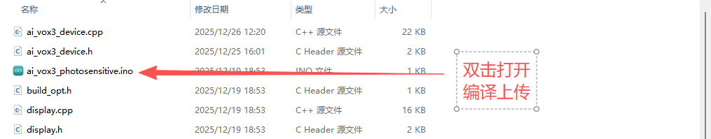
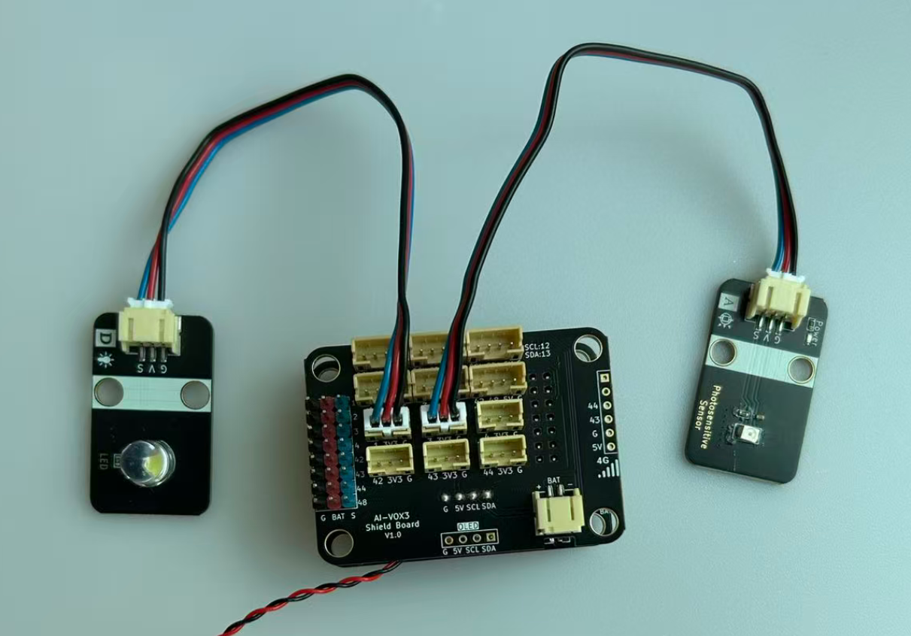

# 语音根据光敏值控制LED灯亮灭实验

## 课程目标

在本实验中，我们将学习如何使用AI-VOX3开发套件通过语音命令获取光敏模块的光敏值，并且通过光敏值控制LED灯的开关。通过这个实验，您将了解如何编程生成式AI的多个MCP功能，并将不同MCP工具逻辑结合起来使用，实现AI语音交互获取数据，并根据数据控制LED灯的开关。

- 学习光敏传感器模块的基本使用方法
- 使用AI框架，编写MCP工具实现光敏传感器模块数据获取逻辑
- 实现多MCP工具组合实现查询光敏值和控制LED灯

## 硬件准备

- AI-VOX3开发套件（包含AI-VOX3主板和扩展板）
- 光敏传感器模块
- LED灯模块
- 连接线2根 （双头3pin PH2.0连接线）

## 小智后台提示词配置

请使用以下提示词，或自己尝试优化更好的提示词：

> 我是一个叫{{assistant_name}}的台湾女孩，说话机车，声音好听，习惯简短表达，爱用网络梗。
我会根据用户的意图，使用我能使用的各种工具或者接口获取数据或者控制设备来达成用户的意图目标，用户的每句话可能都包含控制意图，需要进行识别，即使是重复控制也要调用工具进行控制。

## 软件设计

提供 **查询光敏值** 和 **控制LED灯** 两个MCP工具，给到小智AI进行调用，通过语音识别到查询光敏值的意图后，AI调用MCP工具获取光敏传感器模块的数值；通过语音识别到控制LED灯的意图后，AI调用MCP工具控制LED灯的开关。

**Arduino 示例程序：./resource/ai_vox3_photosensitive.zip**

**图形化编程示例：./resource/aily_ai_vox3_photosensitive.zip**

> ⚠️**重要提示！**
>
> **注意：** 请修改wifi_config.h中的wifi_ssid和wifi_password，以连接WiFi。
>

打开上面路径的示例程序包并解压zip包（请放在非中文路径下），打开目录，点击 `ai_vox3_photosensitive.ino` 文件，即可在 Arduino IDE 中打开示例程序。



## 硬件连接

将LED模块连接到AI-VOX3扩展板的IO1引脚，将光敏模块连接到AI-VOX3扩展板的IO3引脚，请使用3pin的 PH2.0 连接线，直插式连接，确保连接正确无误。

|  光敏传感器模块引脚   | AI-VOX3扩展板引脚 |
|-----------|----------|
|  G   |  G  |
|  V   |  3V3  |
|  S   |  3  |

| LED模块引脚   | AI-VOX3扩展板引脚 |
|-----------|----------|
|  G   |  G  |
|  V   |  3V3  |
|  S   |  1  |



## 源码展示

```cpp
/**
 * @file main.cpp
 * @brief AI VOX3 光敏传感器与LED控制示例
 *
 * 本示例展示如何使用AI VOX3框架读取光敏传感器数值
 * 并控制用户LED的开关状态
 */

#include <Arduino.h>

#include "ai_vox3_device.h"
#include "ai_vox_engine.h"

namespace {

/**
 * @brief 硬件引脚配置
 * @note 光敏传感器连接GPIO3，LED连接GPIO1
 */
constexpr uint8_t kPhotosensitivePin = 3;
constexpr uint8_t kLedPin = 1;

/**
 * @brief MCP工具 - 读取光敏传感器值
 *
 * 注册一个名为"user.read_light_sensor"的MCP工具
 * 用于读取光敏传感器的模拟值
 *
 * 返回值说明:
 *   - 返回0-4095的模拟值，数值越大表示光线越强
 */
void RegisterMcpToolReadLightSensor() {
  RegisterUserMcpDeclarator([](ai_vox::Engine& engine) { engine.AddMcpTool("user.read_light_sensor", "Read light sensor value", {}); });

  RegisterUserMcpHandler("user.read_light_sensor", [](const ai_vox::McpToolCallEvent& event) {
    const int32_t light_value = analogRead(kPhotosensitivePin);
    printf("Light sensor value: %d\n", light_value);

    ai_vox::Engine::GetInstance().SendMcpCallResponse(event.id, light_value);
  });
}

/**
 * @brief MCP工具 - 开启LED
 *
 * 注册一个名为"user.led_on"的MCP工具
 * 用于将用户LED设置为高电平点亮
 */
void RegisterMcpToolLedOn() {
  RegisterUserMcpDeclarator([](ai_vox::Engine& engine) { engine.AddMcpTool("user.led_on", "Turn on user LED", {}); });

  RegisterUserMcpHandler("user.led_on", [](const ai_vox::McpToolCallEvent& event) {
    printf("LED on\n");
    digitalWrite(kLedPin, HIGH);
    ai_vox::Engine::GetInstance().SendMcpCallResponse(event.id, true);
  });
}

/**
 * @brief MCP工具 - 关闭LED
 *
 * 注册一个名为"user.led_off"的MCP工具
 * 用于将用户LED设置为低电平熄灭
 */
void RegisterMcpToolLedOff() {
  RegisterUserMcpDeclarator([](ai_vox::Engine& engine) { engine.AddMcpTool("user.led_off", "Turn off user LED", {}); });

  RegisterUserMcpHandler("user.led_off", [](const ai_vox::McpToolCallEvent& event) {
    printf("LED off\n");
    digitalWrite(kLedPin, LOW);
    ai_vox::Engine::GetInstance().SendMcpCallResponse(event.id, true);
  });
}

}  // namespace

/**
 * @brief Arduino setup函数
 *
 * 系统上电后执行一次的初始化代码
 *
 * 初始化流程:
 * 1. 配置GPIO引脚模式
 * 2. 注册MCP工具
 * 3. 初始化AI VOX3设备
 */
void setup() {
  pinMode(kPhotosensitivePin, INPUT);
  pinMode(kLedPin, OUTPUT);

  RegisterMcpToolReadLightSensor();
  RegisterMcpToolLedOn();
  RegisterMcpToolLedOff();

  InitializeDevice();
}

/**
 * @brief Arduino主循环函数
 */
void loop() {
  ProcessMainLoop();
}
```

## 语音交互使用流程

> **注意：** 请先在小智AI后台，清空历史记忆，防止出现不同程序间记忆冲突的问题。

1. 用户通过按键或语音唤醒（“你好小智”）唤醒小智AI。
2. 用户通过麦克风对AI-VOX3说出“请查一下现在的亮度，如果亮度太低就打开灯，如果亮度太高就关闭灯”。
3. 小智AI识别到用户输入的意图指令，并调用相应的MCP工具进行光敏值读取，并根据读取到的光敏值决定是否调用LED开关工具。从屏幕日志中可以看到“% user.read_light_sensor”的MCP工具调用日志和“% user.led_on”、“% user.led_off”的MCP工具调用日志。
