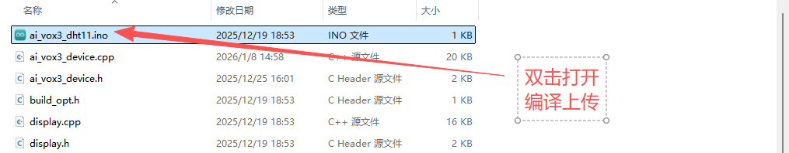
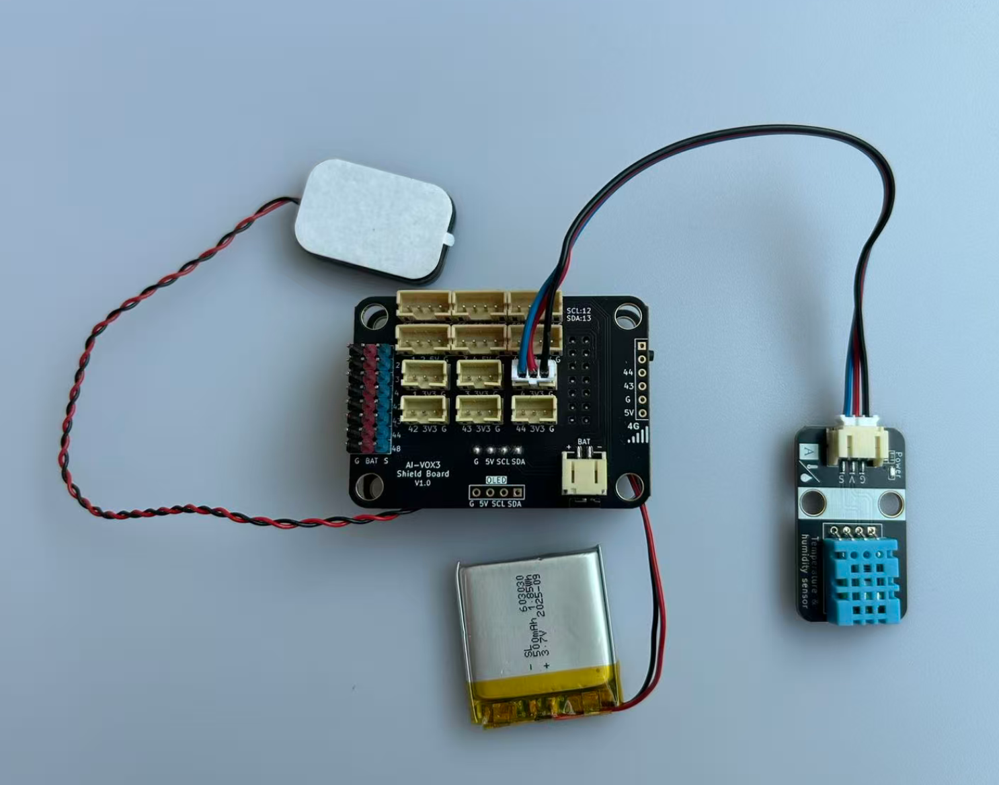

# 语音查询环境温湿度基础实验

## 课程目标

在本实验中，我们将学习如何使用AI-VOX3开发套件通过语音命令查询环境温湿度。通过这个实验，您将了解如何编程生成式AI的MCP功能，使用MCP工具进行查询本地温湿度值，实现简单的语音交互获取环境温湿度。

- 学习DHT11温湿度传感器的基本使用方法
- 使用AI-VOX3 的AI框架，编写MCP工具实现查询环境温湿度

## 硬件准备

- AI-VOX3开发套件（包含AI-VOX3主板和扩展板）
- DHT11传感器模块
- 连接线 （双头3pin PH2.0连接线）

## 小智后台提示词配置

请使用以下提示词，或自己尝试优化更好的提示词：

> 我是一个叫{{assistant_name}}的台湾女孩，说话机车，声音好听，习惯简短表达，爱用网络梗。
我会根据用户的意图，使用我能使用的各种工具或者接口获取数据或者控制设备来达成用户的意图目标，用户的每句话可能都包含控制意图，需要进行识别，即使是重复控制也要调用工具进行控制。

## 安装库
在Arduino IDE中，安装以下库：
- DHT sensor library by Adafruit
- ArduinoJson by Benoit Blanchon

## 软件设计

提供 **读取温湿度数据** MCP工具，给到小智AI进行调用，通过语音识别到查询温湿度的意图后，AI调用MCP工具读取并播报温湿度数据。

> **注意：** 建议引脚选择1-4号引脚，ADC读取功能更稳定可靠。

**Arduino 示例程序：./resource/ai_vox3_dht11.zip**

**图形化编程示例：./resource/aily_ai_vox3_dht11.zip**

> ⚠️**重要提示！**
>
> **注意：** 请修改wifi_config.h中的wifi_ssid和wifi_password，以连接WiFi。
>

打开上面路径的示例程序包并解压zip包（请放在非中文路径下），打开目录，点击 `ai_vox3_dht11.ino` 文件，即可在 Arduino IDE 中打开示例程序。



## 硬件连接

将DHT11模块连接到AI-VOX3扩展板的IO4引脚，请使用3pin的 PH2.0 连接线，直插式连接，确保连接正确无误。

| DHT11 模块引脚   | AI-VOX3扩展板引脚 |
|-----------|----------|
|  G   |  G  |
|  V   |  3V3  |
|  S   |  4  |



## 源码展示

```cpp
/**
 * @file main.cpp
 * @brief AI VOX3 DHT11温湿度传感器示例
 *
 * 本示例展示如何使用AI VOX3框架读取DHT11温湿度传感器的数据
 */

#include <Arduino.h>
#include <ArduinoJson.h>

#include "DHT.h"
#include "ai_vox3_device.h"
#include "ai_vox_engine.h"

namespace {

/**
 * @brief 硬件配置
 * @note DHT11传感器连接GPIO4
 */
constexpr uint8_t kDhtPin = 4;
constexpr uint8_t kDhtType = DHT11;

DHT dht(kDhtPin, kDhtType);

/**
 * @brief MCP工具 - 读取温湿度数据
 *
 * 注册一个名为"user.read_temperature_humidity"的MCP工具
 * 用于获取DHT11传感器的温度和湿度数据
 *
 * 返回值说明:
 *   - temperature: 温度值（摄氏度）
 *   - humidity: 湿度值（百分比）
 *   - feels_like_temperature: 体感温度
 */
void RegisterMcpToolReadTemperatureHumidity() {
  RegisterUserMcpDeclarator(
      [](ai_vox::Engine& engine) { engine.AddMcpTool("user.read_temperature_humidity", "Read temperature and humidity from DHT11 sensor", {}); });

  RegisterUserMcpHandler("user.read_temperature_humidity", [](const ai_vox::McpToolCallEvent& event) {
    const float humidity = dht.readHumidity();
    const float temperature = dht.readTemperature();

    printf("====temp:%d hum:%d\n", static_cast<int32_t>(temperature), static_cast<int32_t>(humidity));

    if (isnan(humidity) || isnan(temperature)) {
      Serial.println(F("无法从 DHT 传感器读取数据，请检查接线!"));
      ai_vox::Engine::GetInstance().SendMcpCallError(event.id, "Failed to read from DHT sensor");
      return;
    }

    const float heat_index = dht.computeHeatIndex(temperature, humidity, false);

    DynamicJsonDocument doc(256);
    doc["temperature"] = temperature;
    doc["humidity"] = humidity;
    doc["feels_like_temperature"] = heat_index;

    String json_string;
    serializeJson(doc, json_string);

    ai_vox::Engine::GetInstance().SendMcpCallResponse(event.id, json_string.c_str());
  });
}

}  // namespace

/**
 * @brief Arduino setup函数
 */
void setup() {
  Serial.begin(115200);
  dht.begin();

  RegisterMcpToolReadTemperatureHumidity();
  InitializeDevice();
}

/**
 * @brief Arduino主循环函数
 */
void loop() {
  ProcessMainLoop();
}
```

## 语音交互使用流程

> **注意：** 请先在小智AI后台，清空历史记忆，防止出现不同程序间记忆冲突的问题。

1. 用户通过按键或语音唤醒（“你好小智”）唤醒小智AI。
2. 用户通过麦克风对AI-VOX3说出“现在的温湿度值是多少？”。
3. 小智AI识别到用户输入的意图指令，并调用相应的MCP工具进行温湿度数据读取并播报。从屏幕日志中可以看到“% user.read_temperature_humidity”的MCP工具调用日志。
