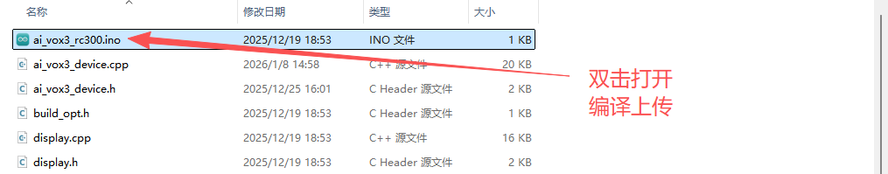
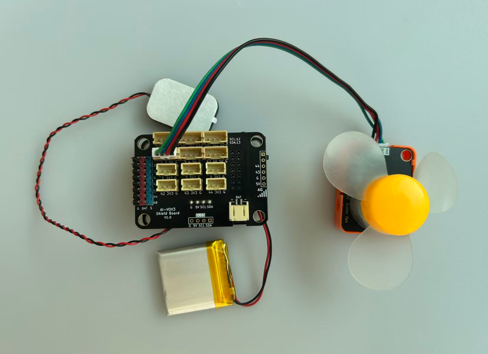

# 语音控制摇头风扇进阶实验

## 课程目标

在本实验中，我们将学习如何使用AI-VOX3开发套件通过语音命令控制基于SG90舵机的摇头速度和基于RC300电机风扇风速等功能。通过这个实验，您将了解如何编程生成式AI的MCP功能，并将其与舵机和电机控制逻辑结合起来，实现智能语音交互控制摇头风扇。

- 学习RC300电机风扇的基本使用方法
- 学习如何使用MCP工具控制电机风扇开关和风速

## 硬件准备

- AI-VOX3开发套件（包含AI-VOX3主板和扩展板）
- RC300电机风扇模块
- 连接线 （双头4pin PH2.0连接线）

## 小智后台提示词配置

请使用以下提示词，或自己尝试优化更好的提示词：

> 我是一个叫{{assistant_name}}的台湾女孩，说话机车，声音好听，习惯简短表达，爱用网络梗。
我会根据用户的意图，使用我能使用的各种工具或者接口获取数据或者控制设备来达成用户的意图目标，用户的每句话可能都包含控制意图，需要进行识别，即使是重复控制也要调用工具进行控制。

## 安装库
在Arduino IDE中，安装以下库：
- ArduinoJson by Benoit Blanchon

## 软件设计

提供 **设置风扇风速挡位** 的MCP工具，给到小智AI进行调用，通过语音识别到控制风扇风速挡位的意图后，AI调用MCP工具控制电机风扇风速。

**Arduino 示例程序：./resource/ai_vox3_rc300.zip**

**图形化编程示例：./resource/aily_ai_vox3_rc300.zip**

> ⚠️**重要提示！**
>
> **注意：** 请修改wifi_config.h中的wifi_ssid和wifi_password，以连接WiFi。
>

打开上面路径的示例程序包并解压zip包（请放在非中文路径下），打开目录，点击 `ai_vox3_rc300.ino` 文件，即可在 Arduino IDE 中打开示例程序。



## 硬件连接

将RC300电机模块连接到AI-VOX3扩展板的IO1、IO2引脚，请使用4pin的 PH2.0 连接线，直插式连接，确保连接正确无误。

| RC300电机模块引脚 | AI-VOX3扩展板引脚 |
| --- | --- |
| G | G |
| V | 5V |
| INA | 1 |
| INB | 2 |



## 源码展示

```cpp
/**
 * @file main.cpp
 * @brief AI VOX3 RC300电机控制示例
 *
 * 本示例展示如何使用AI VOX3框架控制RC300电机的正反转和转速
 */

#include <Arduino.h>
#include <ArduinoJson.h>

#include "ai_vox3_device.h"
#include "ai_vox_engine.h"

namespace {

/**
 * @brief 硬件引脚配置
 * @note RC300电机驱动模块的INB和INA控制引脚
 */
constexpr uint8_t kMotorInbPin = 1;
constexpr uint8_t kMotorInaPin = 2;

/**
 * @brief MCP工具 - 控制电机转动
 *
 * 注册一个名为"user.control_motor"的MCP工具
 * 用于控制电机的正反转和转速
 *
 * 参数说明:
 *   - direction: 转动方向，true为正向，false为反向（必填）
 *   - speed: 转速，范围0-255（默认0）
 */
void RegisterMcpToolControlMotor() {
  RegisterUserMcpDeclarator([](ai_vox::Engine& engine) {
    engine.AddMcpTool("user.control_motor",
                      "Control motor direction and speed",
                      {
                          {"direction",
                           ai_vox::ParamSchema<bool>{
                               .default_value = std::nullopt,
                           }},
                          {"speed",
                           ai_vox::ParamSchema<int64_t>{
                               .default_value = 0,
                               .min = 0,
                               .max = 255,
                           }},
                      });
  });

  RegisterUserMcpHandler("user.control_motor", [](const ai_vox::McpToolCallEvent& event) {
    const auto direction_ptr = event.param<bool>("direction");
    const auto speed_ptr = event.param<int64_t>("speed");

    if (direction_ptr == nullptr) {
      ai_vox::Engine::GetInstance().SendMcpCallError(event.id, "Missing required argument: direction");
      return;
    }

    if (speed_ptr == nullptr) {
      ai_vox::Engine::GetInstance().SendMcpCallError(event.id, "Missing required argument: speed");
      return;
    }

    const bool direction_value = *direction_ptr;
    const int64_t speed = *speed_ptr;

    if (speed < 0 || speed > 255) {
      ai_vox::Engine::GetInstance().SendMcpCallError(event.id, "Speed must be between 0 and 255");
      return;
    }

    if (speed == 0) {
      analogWrite(kMotorInaPin, 0);
      analogWrite(kMotorInbPin, 0);
      digitalWrite(kMotorInaPin, LOW);
      digitalWrite(kMotorInbPin, LOW);
      printf("Motor stopped\n");
    } else if (direction_value) {
      digitalWrite(kMotorInaPin, LOW);
      digitalWrite(kMotorInbPin, LOW);
      delay(50);
      digitalWrite(kMotorInbPin, LOW);
      analogWrite(kMotorInaPin, static_cast<uint8_t>(speed));
      printf("Motor running forward: speed=%d\n", static_cast<uint8_t>(speed));
    } else {
      digitalWrite(kMotorInaPin, LOW);
      digitalWrite(kMotorInbPin, LOW);
      delay(50);
      digitalWrite(kMotorInaPin, LOW);
      analogWrite(kMotorInbPin, static_cast<uint8_t>(speed));
      printf("Motor running backward: speed=%d\n", static_cast<uint8_t>(speed));
    }

    printf("Motor running: direction=%s, speed=%d\n", direction_value ? "true" : "false", static_cast<uint8_t>(speed));

    DynamicJsonDocument doc(256);
    doc["status"] = "success";
    doc["direction"] = direction_value;
    doc["speed"] = speed;

    String json_string;
    serializeJson(doc, json_string);

    ai_vox::Engine::GetInstance().SendMcpCallResponse(event.id, json_string.c_str());
  });
}

}  // namespace

/**
 * @brief Arduino setup函数
 */
void setup() {
  Serial.begin(115200);

  pinMode(kMotorInbPin, OUTPUT);
  pinMode(kMotorInaPin, OUTPUT);

  RegisterMcpToolControlMotor();
  InitializeDevice();
}

/**
 * @brief Arduino主循环函数
 */
void loop() {
  ProcessMainLoop();
}
```

## 语音交互使用流程

> **注意：** 请先在小智AI后台，清空历史记忆，防止出现不同程序间记忆冲突的问题。

1. 用户通过按键或语音唤醒（“你好小智”）唤醒小智AI。
2. 用户通过麦克风对AI-VOX3说出“打开风扇”、“摇头设置为2挡”。
3. 小智AI识别到用户输入的意图指令，并调用相应的MCP工具进行风扇的控制。从屏幕日志中可以看到“% user.control_head_swing”和“% user.control_fan_speed”的MCP工具调用日志。
