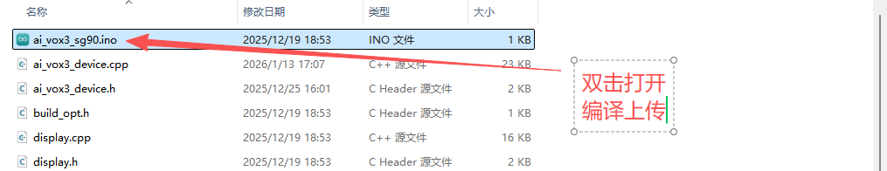
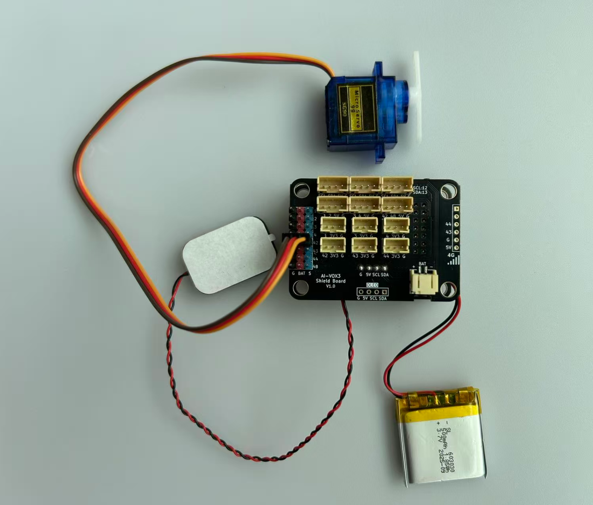

# 语音控制舵机角度基础实验

## 课程目标

在本实验中，我们将学习如何使用AI-VOX3开发套件通过语音命令控制舵机转动到指定角度。通过这个实验，您将了解如何编程生成式AI的MCP功能，并将其与舵机控制逻辑结合起来，实现简单的语音交互控制舵机转动。

- 学习9G舵机模块的基本使用方法
- 使用 AI-VOX3 的AI框架，编写MCP工具实现舵机控制

## 硬件准备

- AI-VOX3开发套件（包含AI-VOX3主板和扩展板）
- 9G舵机模块

## 小智后台提示词配置

请使用以下提示词，或自己尝试优化更好的提示词：

> 我是一个叫{{assistant_name}}的台湾女孩，说话机车，声音好听，习惯简短表达，爱用网络梗。
我会根据用户的意图，使用我能使用的各种工具或者接口获取数据或者控制设备来达成用户的意图目标，用户的每句话可能都包含控制意图，需要进行识别，即使是重复控制也要调用工具进行控制。

## 安装库
在Arduino IDE中，安装以下库：
- ArduinoJson by Benoit Blanchon

## 软件设计

提供 **设置舵机角度** MCP工具，给到小智AI进行调用，通过语音识别到控制舵机角度的意图后，AI调用MCP工具控制舵机转动到指定角度。

**Arduino 示例程序：./resource/ai_vox3_sg90.zip**

**图形化编程示例：./resource/aily_ai_vox3_sg90.zip**

> ⚠️**重要提示！**
>
> **注意：** 请修改wifi_config.h中的wifi_ssid和wifi_password，以连接WiFi。
>

打开上面路径的示例程序包并解压zip包（请放在非中文路径下），打开目录，点击 `ai_vox3_sg90.ino` 文件，即可在 Arduino IDE 中打开示例程序。



## 硬件连接

将SG90舵机模块连接到AI-VOX3扩展板的IO42引脚，请注意舵机的排线方向，参考9G舵机模块的基础介绍中引脚图，确保连接正确无误。

|  舵机模块引脚   | AI-VOX3扩展板引脚 |
|  ----   |  ----  |
|  GND(棕色)   |  G  |
|  VCC(红色)   |  BAT  |
|  PWM(橙色)   |  42  |



## 源码展示

```cpp
#include <Arduino.h>
#include <ArduinoJson.h>

#include "ai_vox3_device.h"
#include "ai_vox_engine.h"
#include "servo.h"

namespace {

constexpr uint8_t kServoPin = 42;
constexpr uint32_t kMinPulse = 500;
constexpr uint32_t kMaxPulse = 2500;
constexpr uint16_t kMaxServoAngle = 180;

auto servo = em::Servo(kServoPin, 0, kMaxServoAngle, kMinPulse, kMaxPulse);

/**
 * @brief MCP工具 - 控制9G舵机
 *
 * 该函数注册一个名为 "user.control_servo" 的MCP工具，用于控制舵机的角度。
 *
 * 工具名称: user.control_servo
 * 工具描述: Control servo angle
 *
 * 参数:
 *   - angle (int64_t): 舵机角度，范围0-180度
 *     - required: 是
 *     - min: 0
 *     - max: 180
 *     - default_value: 无
 *
 * 返回值:
 *   - status: 操作状态 ("success")
 *   - angle: 设置的角度值
 *   - gpio: 使用的GPIO引脚编号
 */
void McpToolControlServo() {
  RegisterUserMcpDeclarator([](ai_vox::Engine& engine) {
    engine.AddMcpTool("user.control_servo",
                      "Control servo angle",
                      {{"angle",
                        ai_vox::ParamSchema<int64_t>{
                            .default_value = std::nullopt,
                            .min = 0,
                            .max = kMaxServoAngle,
                        }}});
  });

  RegisterUserMcpHandler("user.control_servo", [](const ai_vox::McpToolCallEvent& event) {
    const auto angle_ptr = event.param<int64_t>("angle");

    if (angle_ptr == nullptr) {
      ai_vox::Engine::GetInstance().SendMcpCallError(event.id, "Missing required argument: angle");
      return;
    }

    const int64_t angle = *angle_ptr;

    if (angle < 0 || angle > 180) {
      ai_vox::Engine::GetInstance().SendMcpCallError(event.id, "Angle must be between 0 and 180");
      return;
    }

    servo.Write(static_cast<uint16_t>(angle));
    printf("Servo moved to angle: %d (GPIO %d)\n", static_cast<uint16_t>(angle), static_cast<int>(kServoPin));

    DynamicJsonDocument doc(256);
    doc["status"] = "success";
    doc["angle"] = angle;
    doc["gpio"] = static_cast<int>(kServoPin);

    String jsonString;
    serializeJson(doc, jsonString);

    ai_vox::Engine::GetInstance().SendMcpCallResponse(event.id, jsonString.c_str());
  });
}

}  // namespace

void setup() {
  Serial.begin(115200);
  delay(500);

  printf("\n========== Servo Initialization ==========\n");

  if (!servo.Init()) {
    printf("Error: Failed to init servo on pin %d\n", kServoPin);
  }

  servo.Write(90);

  printf("========================================\n\n");

  McpToolControlServo();

  InitializeDevice();
}

void loop() {
  ProcessMainLoop();
}
```

## 语音交互使用流程

> **注意：** 请先在小智AI后台，清空历史记忆，防止出现不同程序间记忆冲突的问题。

1. 用户通过按键或语音唤醒（“你好小智”）唤醒小智AI。
2. 用户通过麦克风对AI-VOX3说出“把舵机转到120度”。
3. 小智AI识别到用户输入的意图指令，并调用相应的MCP工具进行舵机角度控制。从屏幕日志中可以看到“% user.control_servo”的MCP工具调用日志。
