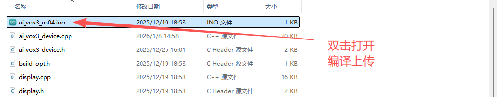
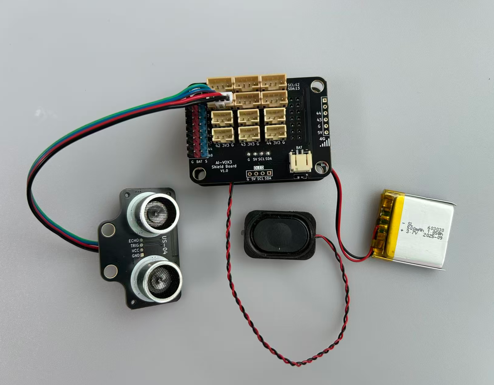

# 语音查询障碍物距离基础实验

## 课程目标

在本实验中，我们将学习如何使用AI-VOX3开发套件通过语音命令查询障碍物距离。通过这个实验，您将了解如何编程生成式AI的MCP功能，使用MCP工具进行查询障碍物距离值，实现简单的语音交互获取障碍物距离。

- 学习US04超声波传感器的基本使用方法
- 使用AI-VOX3 的AI框架，编写MCP工具实现查询超声波传感器测量距离值

## 硬件准备

- AI-VOX3开发套件（包含AI-VOX3主板和扩展板）
- US04超声波传感器模块
- 连接线 （双头3pin PH2.0连接线）

## 小智后台提示词配置

请使用以下提示词，或自己尝试优化更好的提示词：

> 我是一个叫{{assistant_name}}的台湾女孩，说话机车，声音好听，习惯简短表达，爱用网络梗。
我会根据用户的意图，使用我能使用的各种工具或者接口获取数据或者控制设备来达成用户的意图目标，用户的每句话可能都包含控制意图，需要进行识别，即使是重复控制也要调用工具进行控制。

## 安装库
在Arduino IDE中，安装以下库：
- ArduinoJson by Benoit Blanchon

## 软件设计

提供 **读取距离数据** MCP工具，给到小智AI进行调用，通过语音识别到查询距离的意图后，AI调用MCP工具读取并播报距离数据。

> **注意：** 建议引脚选择1-4号引脚，ADC读取功能更稳定可靠。

**Arduino 示例程序：./resource/ai_vox3_us04.zip**

**图形化编程示例：./resource/aily_ai_vox3_us04.zip**

> ⚠️**重要提示！**
>
> **注意：** 请修改wifi_config.h中的wifi_ssid和wifi_password，以连接WiFi。
>

打开上面路径的示例程序包并解压zip包（请放在非中文路径下），打开目录，点击 `ai_vox3_us04.ino` 文件，即可在 Arduino IDE 中打开示例程序。



## 硬件连接

将US04超声波模块连接到AI-VOX3扩展板的IO1、IO2引脚，请使用4pin的 PH2.0 连接线，直插式连接，确保连接正确无误。

| US04模块引脚 | AI-VOX3扩展板引脚 |
| --- | --- |
| VCC | 5V |
| GND | G |
| Trig | 2 |
| Echo | 1 |



## 源码展示

```cpp
#include <Arduino.h>
#include <ArduinoJson.h>

#include "ai_vox3_device.h"
#include "ai_vox_engine.h"

namespace {

constexpr gpio_num_t kUs04PinTrig = GPIO_NUM_2;
constexpr gpio_num_t kUs04PinEcho = GPIO_NUM_1;
constexpr uint16_t kUs04Timeout = 30000;

/**
 * @brief 测量US04超声波传感器的距离
 *
 * 该函数通过控制US04超声波传感器发送触发信号并接收回波信号，
 * 计算出物体与传感器之间的距离。
 *
 * 工作原理：发送10微秒的高电平触发信号，传感器发出超声波脉冲，
 * 当接收到反射回来的超声波时，回波引脚会输出高电平信号，
 * 通过测量高电平持续时间来计算距离。
 *
 * @return float 返回测量到的距离值（单位：厘米）
 *               如果测量超时则返回-1
 */
float MeasureUs04UltrasonicDistance() {
  digitalWrite(kUs04PinTrig, LOW);
  delayMicroseconds(2);
  digitalWrite(kUs04PinTrig, HIGH);
  delayMicroseconds(10);
  digitalWrite(kUs04PinTrig, LOW);

  const auto duration = pulseIn(kUs04PinEcho, HIGH, kUs04Timeout);

  if (duration <= 0) {
    printf("Error: US04 sensor measure timeout.\n");
    return -1.0f;
  }
  return static_cast<float>(duration * 0.034 / 2);
}

/**
 * @brief MCP工具 - US04超声波传感器测距功能
 *
 * 该函数注册一个名为 "user.ultrasonic_sensor.get_distance" 的MCP工具，
 * 用于获取US04超声波传感器测量的距离数据。
 *
 * 工具名称: user.ultrasonic_sensor.get_distance
 * 工具描述: Get distance from US04 ultrasonic sensor
 *
 * 参数: 无
 *
 * 返回值:
 *   - 成功时返回距离值（厘米），作为字符串形式返回
 *   - 失败时返回错误信息
 */
void McpToolUs04UltrasonicSensor() {
  RegisterUserMcpDeclarator(
      [](ai_vox::Engine& engine) { engine.AddMcpTool("user.ultrasonic_sensor.get_distance", "Get distance from US04 ultrasonic sensor", {}); });

  RegisterUserMcpHandler("user.ultrasonic_sensor.get_distance", [](const ai_vox::McpToolCallEvent& event) {
    const float distance = MeasureUs04UltrasonicDistance();

    if (distance < 0) {
      ai_vox::Engine::GetInstance().SendMcpCallError(event.id, "Failed to measure distance from US04 sensor");
    } else {
      printf("on mcp tool call: user.ultrasonic_sensor.get_distance, distance: %.1f cm\n", distance);
      ai_vox::Engine::GetInstance().SendMcpCallResponse(event.id, std::to_string(distance).c_str());
    }
  });
}

}  // namespace

void setup() {
  Serial.begin(115200);
  delay(500);

  printf("\n========== US04 Initialization ==========\n");
  pinMode(kUs04PinTrig, OUTPUT);
  pinMode(kUs04PinEcho, INPUT);
  printf("========================================\n\n");

  McpToolUs04UltrasonicSensor();

  InitializeDevice();
}

void loop() {
  ProcessMainLoop();
}
```

## 语音交互使用流程

> **注意：** 请先在小智AI后台，清空历史记忆，防止出现不同程序间记忆冲突的问题。

1. 用户通过按键或语音唤醒（“你好小智”）唤醒小智AI。
2. 用户通过麦克风对AI-VOX3说出“现在障碍物的距离是多少？”。
3. 小智AI识别到用户输入的意图指令，并调用相应的MCP工具进行障碍物距离读取并播报。从屏幕日志中可以看到“% user.ultrasonic_sensor.get_distance”的MCP工具调用日志。
