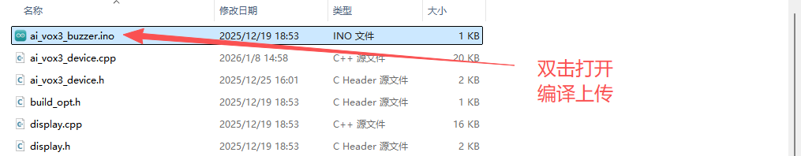
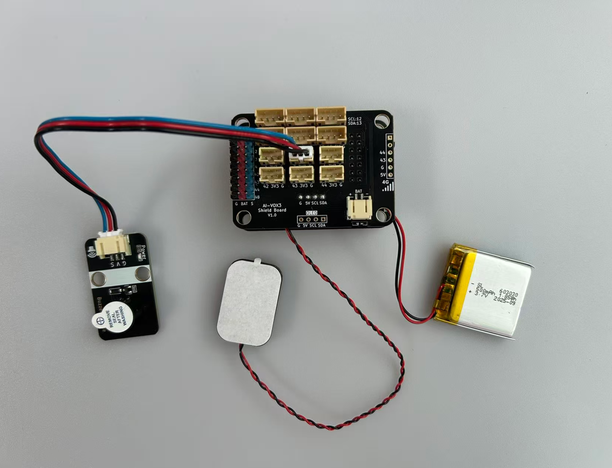

# 基于有源蜂鸣器AI闹钟基础实验

## 需求分析

在本实验中，我们将学习如何使用AI-VOX3开发套件通过语音命令控制有源蜂鸣器，设置AI闹钟。通过这个实验，您将了解如何编程生成式AI的MCP功能，并将有源蜂鸣器模块控制逻辑和AI闹钟结合起来，实现智能语音交互控制有源蜂鸣器报警功能及AI闹钟功能。

- 学习有源蜂鸣器模块的基本使用方法
- 使用AI-VOX3 的AI框架，编写MCP工具实现蜂鸣器报警控制功能
- 使用AI-VOX3 的AI框架，编写MCP工具实现AI闹钟功能

## 硬件准备

- AI-VOX3开发套件（包含AI-VOX3主板和扩展板）
- 有源蜂鸣器模块
- 连接线 （双头3pin PH2.0连接线）

## 小智后台提示词配置

请使用以下提示词，或自己尝试优化更好的提示词：

> 我是一个叫{{assistant_name}}的台湾女孩，说话机车，声音好听，习惯简短表达，爱用网络梗。
我会根据用户的意图，使用我能使用的各种工具或者接口获取数据或者控制设备来达成用户的意图目标，用户的每句话可能都包含控制意图，需要进行识别，即使是重复控制也要调用工具进行控制。

## 安装库
在Arduino IDE中，安装以下库：
- ArduinoJson by Benoit Blanchon

## 软件设计

提供 **触发报警** MCP工具，给到小智AI进行调用，AI识别到设置报警的意图后，AI调用MCP工具设置触发或否关闭蜂鸣器。
提供 **设置AI闹钟** MCP工具，给到小智AI进行调用，AI识别到设置闹钟的意图后，AI调用MCP工具设置定时器。

**Arduino 示例程序：./resource/ai_vox3_buzzer.zip**

**图形化编程示例：./resource/aily_ai_vox3_buzzer.zip**

> ⚠️**重要提示！**
>
> **注意：** 请修改wifi_config.h中的wifi_ssid和wifi_password，以连接WiFi。
>

打开上面路径的示例程序包并解压zip包（请放在非中文路径下），打开目录，点击 `ai_vox3_buzzer.ino` 文件，即可在 Arduino IDE 中打开示例程序。



## 硬件连接

将有源蜂鸣器模块连接到AI-VOX3扩展板的IO3引脚，请使用3pin的 PH2.0 连接线，直插式连接，确保连接正确无误。

| 有源蜂鸣器模块引脚 | AI-VOX3扩展板引脚 |
| ------------------ | ------------------ |
| G                | 3V3                 |
| V                | G                |
| S                 | 3                |



## 源码展示

```cpp
#include <Arduino.h>
#include <ArduinoJson.h>

#include "ai_vox3_device.h"
#include "ai_vox_engine.h"

namespace {

constexpr uint8_t kBuzzerPin = 3;

struct AlarmTimer {
  bool active = false;
  uint32_t start_time = 0;
  uint32_t duration_ms = 0;
  int8_t buzzer_state = 1;
  int64_t event_id = 0;
};

AlarmTimer current_alarm;

/**
 * @brief MCP工具 - 控制有源蜂鸣器报警
 *
 * 该函数注册一个名为 "user.buzzer.control" 的MCP工具，
 * 用于控制有源蜂鸣器的开关状态。
 *
 * 工具名称: user.buzzer.control
 * 工具描述: Control buzzer on/off
 *
 * 参数:
 *   - state (int64_t): 蜂鸣器状态
 *     - required: 是
 *     - min: 0
 *     - max: 1
 *     - default_value: 无
 *     - 说明: 0表示关闭蜂鸣器，1表示开启蜂鸣器
 *
 * 返回值:
 *   - status: 操作状态 ("success")
 *   - state: 设置的状态值
 *   - gpio: 使用的GPIO引脚编号
 */
void McpToolBuzzerControl() {
  RegisterUserMcpDeclarator([](ai_vox::Engine& engine) {
    engine.AddMcpTool("user.buzzer.control",
                      "Control buzzer on/off",
                      {{"state",
                        ai_vox::ParamSchema<int64_t>{
                            .default_value = std::nullopt,
                            .min = 0,
                            .max = 1,
                        }}});
  });

  RegisterUserMcpHandler("user.buzzer.control", [](const ai_vox::McpToolCallEvent& event) {
    const auto state_ptr = event.param<int64_t>("state");

    if (state_ptr == nullptr) {
      ai_vox::Engine::GetInstance().SendMcpCallError(event.id, "Missing required argument: state (0=off, 1=on)");
      return;
    }

    const int64_t state = *state_ptr;

    if (state != 0 && state != 1) {
      ai_vox::Engine::GetInstance().SendMcpCallError(event.id, "State must be 0 (off) or 1 (on)");
      return;
    }

    digitalWrite(kBuzzerPin, static_cast<uint8_t>(state));

    const char* state_str = (state == 1) ? "ON" : "OFF";
    printf("Buzzer turned %s (GPIO %d)\n", state_str, kBuzzerPin);

    DynamicJsonDocument doc(256);
    doc["status"] = "success";
    doc["state"] = state;
    doc["gpio"] = kBuzzerPin;

    String jsonString;
    serializeJson(doc, jsonString);

    ai_vox::Engine::GetInstance().SendMcpCallResponse(event.id, jsonString.c_str());
  });
}

/**
 * @brief MCP工具 - 设置定时闹钟
 *
 * 该函数注册一个名为 "user.alarm.timer" 的MCP工具，
 * 用于设置倒计时，在指定时间后激活蜂鸣器报警。
 *
 * 工具名称: user.alarm.timer
 * 工具描述: Set a countdown timer that triggers buzzer when time is up
 *
 * 参数:
 *   - seconds (int64_t): 倒计时秒数
 *     - required: 是
 *     - min: 1
 *     - max: 3600
 *     - default_value: 无
 *     - 说明: 最少1秒，最多1小时
 *
 *   - buzzer_state (int64_t): 倒计时结束后的蜂鸣器状态
 *     - required: 否
 *     - min: 0
 *     - max: 1
 *     - default_value: 1
 *     - 说明: 0表示关闭蜂鸣器，1表示开启蜂鸣器
 *
 * 返回值:
 *   - status: 操作状态 ("timer_started")
 *   - seconds: 设置的倒计时秒数
 *   - buzzer_state: 设置的蜂鸣器状态
 */
void McpToolAlarmTimer() {
  RegisterUserMcpDeclarator([](ai_vox::Engine& engine) {
    engine.AddMcpTool("user.alarm.timer",
                      "Set a countdown timer that triggers buzzer when time is up",
                      {{"seconds",
                        ai_vox::ParamSchema<int64_t>{
                            .default_value = std::nullopt,
                            .min = 1,
                            .max = 3600,
                        }},
                       {"buzzer_state",
                        ai_vox::ParamSchema<int64_t>{
                            .default_value = 1,
                            .min = 0,
                            .max = 1,
                        }}});
  });

  RegisterUserMcpHandler("user.alarm.timer", [](const ai_vox::McpToolCallEvent& event) {
    const auto seconds_ptr = event.param<int64_t>("seconds");
    const auto buzzer_state_ptr = event.param<int64_t>("buzzer_state");

    if (seconds_ptr == nullptr) {
      ai_vox::Engine::GetInstance().SendMcpCallError(event.id, "Missing required argument: seconds (countdown duration in seconds)");
      return;
    }

    const int64_t seconds = *seconds_ptr;
    const int64_t buzzer_state = buzzer_state_ptr ? *buzzer_state_ptr : 1;

    if (seconds < 1 || seconds > 3600) {
      ai_vox::Engine::GetInstance().SendMcpCallError(event.id, "Seconds must be between 1 and 3600");
      return;
    }

    if (buzzer_state != 0 && buzzer_state != 1) {
      ai_vox::Engine::GetInstance().SendMcpCallError(event.id, "Buzzer state must be 0 (off) or 1 (on)");
      return;
    }

    current_alarm.active = true;
    current_alarm.start_time = millis();
    current_alarm.duration_ms = static_cast<uint32_t>(seconds * 1000);
    current_alarm.buzzer_state = static_cast<int8_t>(buzzer_state);
    current_alarm.event_id = event.id;

    printf("Starting alarm timer for %lld seconds\n", static_cast<long long>(seconds));

    DynamicJsonDocument doc(256);
    doc["status"] = "timer_started";
    doc["seconds"] = seconds;
    doc["buzzer_state"] = buzzer_state;

    String jsonString;
    serializeJson(doc, jsonString);

    ai_vox::Engine::GetInstance().SendMcpCallResponse(event.id, jsonString.c_str());
  });
}

/**
 * @brief 检查并处理定时器到期事件
 *
 * 该函数在loop中定期调用，用于检查定时器是否到期，
 * 如果到期则触发蜂鸣器并发送响应。
 */
void CheckAndProcessAlarm() {
  if (current_alarm.active) {
    const uint32_t elapsed_time = millis() - current_alarm.start_time;

    if (elapsed_time >= current_alarm.duration_ms) {
      digitalWrite(kBuzzerPin, static_cast<uint8_t>(current_alarm.buzzer_state));

      const char* state_str = (current_alarm.buzzer_state == 1) ? "ON" : "OFF";
      printf("Alarm triggered! Buzzer turned %s (GPIO %d)\n", state_str, kBuzzerPin);

      DynamicJsonDocument response_doc(256);
      response_doc["status"] = "alarm_triggered";
      response_doc["buzzer_state"] = current_alarm.buzzer_state;
      response_doc["duration_seconds"] = current_alarm.duration_ms / 1000;

      String response_json;
      serializeJson(response_doc, response_json);

      ai_vox::Engine::GetInstance().SendMcpCallResponse(current_alarm.event_id, response_json.c_str());

      current_alarm.active = false;
    }
  }
}

}  // namespace

void setup() {
  Serial.begin(115200);
  delay(500);

  pinMode(kBuzzerPin, OUTPUT);
  digitalWrite(kBuzzerPin, LOW);

  McpToolBuzzerControl();
  McpToolAlarmTimer();

  InitializeDevice();
}

void loop() {
  CheckAndProcessAlarm();

  ProcessMainLoop();
}
```

## 语音交互使用流程

> **注意：** 请先在小智AI后台，清空历史记忆，防止出现不同程序间记忆冲突的问题。

1. 用户通过按键或语音唤醒（“你好小智”）唤醒小智AI。
2. 用户通过麦克风对AI-VOX3说出“触发报警” 或 “关闭报警”。
3. 小智AI识别到用户输入的意图指令，并调用相应的MCP工具进行触发报警或关闭报警动作。从屏幕日志中可以看到“% user.buzzer.control”的MCP工具调用日志。
4. 用户通过麦克风对AI-VOX3说出“设置闹钟，10秒后提醒我”。
5. 小智AI识别到用户输入的意图指令，并调用相应的MCP工具进行设置闹钟动作。从屏幕日志中可以看到“% user.alarm.timer”的MCP工具调用日志，10秒后触发的闹钟会通过蜂鸣器发出提示声。
