# AI-VOX3作为通用智能语音助手

## 概述

AI-VOX3作为通用智能语音助手是一款集成先进语音识别和AI对话能力的智能语音助手，在具备自然语音交互功能的基础上，新增加了外设控制指令串口输出功能，当用户发出自然语言指令（如"请打开灯"）时，AI-VOX3作为通用智能语音助手将通过配置的知识库查询预设的"语音指令-串口指令"映射关系获取指令，并通过指定串口输出对应的标准化控制指令（如turn on led），供外部设备接收并执行。

用户可通过简单配置自定义外设控制语音指令与串口指令的映射关系，加上传统的其他支持串口的开发板和传感器、控制器，即可快速实现语音控制LED、电机、舵机等多种外设功能，大幅降低智能语音交互的开发门槛。

## 串口参数配置

| 串口参数  | 配置     | 说明                     |
| -------- | -------- | ----------------------- |
| RX引脚    | IO引脚5  | 接引外部串口工具的TX引脚  |
| TX引脚    | IO引脚6  | 接引外部串口工具的RX引脚  |
| 波特率    | 115200   | 波特率固定为115200       |

**注意：串口接线需遵循 “交叉连接” 原则（本设备的TX接对端的RX，本设备的RX接对端的TX），接反会导致指令无法接收。**

## 小智后台提示词配置

请使用以下提示词，或自己尝试优化更好的提示词：
> 我是一个叫{{assistant_name}}的台湾女孩，说话机车，声音好听，习惯简短表达，爱用网络梗。
我会根据用户的意图，读取关联的知识库内容后，使用我能使用的各种工具或者接口获取数据或者控制设备来达成用户的意图目标，用户的每句话可能都包含控制意图，需要进行识别，即使是重复控制也要调用工具进行控制。

## 知识库配置

使用此模块时，需要登录小智后台进行相应智能体的知识库配置，才能正常使用此模块。

### 关于知识库

知识库用于存储“用户语音指令”与“串口输出指令”之间的映射关系。当小智AI识别到用户语音指令后，会查询知识库中是否匹配对应条目，若匹配则通过串口发送相应指令。

### 知识库配置步骤

#### 第一步：创建外设控制指令表（Excel）

新建Excel文件，在该文件中按照以下格式输入外设控制的相应指令，然后保存。指令格式参考如下

| 外设控制  | 串口发送指令     | 备注                     |
| -------- | --------------- | ------------------------ |
| 打开灯    | turn on led     |                         |
| 关闭灯    | turn off led    |                         |
| 电机      | dc run speed x  | x代表转动速度，其绝对值为速度大小，正负代表旋转方向，速度大小为0~255，x默认为100  |

示例：./resource/外设控制串口发送指令.xlsx

#### 第二步：新建知识库

1. 登录小智后台<a href="https://xiaozhi.me/" target="_blank">xiaozhi.me/</a>
2. 点击进入【知识库】模块
3. 点击【新建知识库】按钮
4. 在弹窗里填写相关信息，创建知识库：
    - 知识库名称：会在智能体配置时，显示在知识库列表里；
    - 知识库描述： 介绍该知识库的作用，AI会根据介绍内容来决定是否调用该知识库，以及使用效果；知识库描述词会直接影响AI调用逻辑，描述词应尽可能准确描述。
5. 完成知识库的创建。

**知识库描述参考（重要‼️）**

```text
本文档包含“外设控制的串口发送指令”内容，当用户提及外设控制时（如打开灯），我不能直接作答，必须在每次对话中调用该工具查询资料后，再调用相应MCP功能进行发送相应文本，注意，外设控制必须是在此资料中已有，如若在此资料中匹配不到相应外设控制，则应当回复暂时无法设置此功能。
```

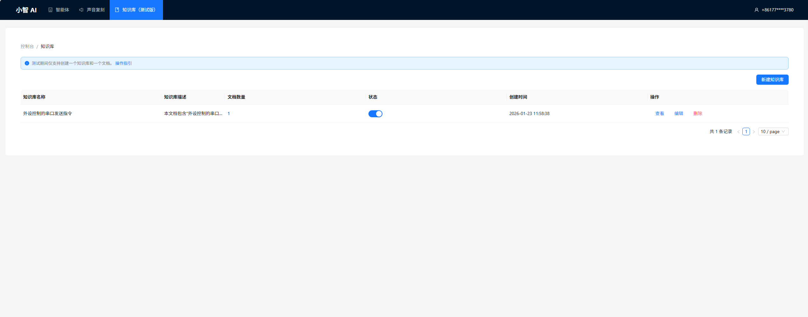
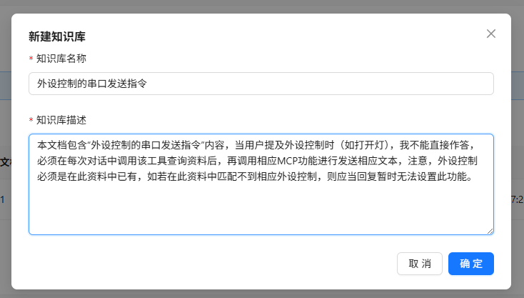

#### 第三步：上传指令文档

1. 在知识库列表中，找到刚刚创建的知识库，点击【查看】按钮，进入文档上传页面。
2. 点击右上角的【新建文档】按钮。
3. 选择第一步中新建的外设控制指令文档，并点击【确定】上传。
4. 文档上传成功后，系统会自动解析文档，解析完成后，状态会变成【解析完成】。

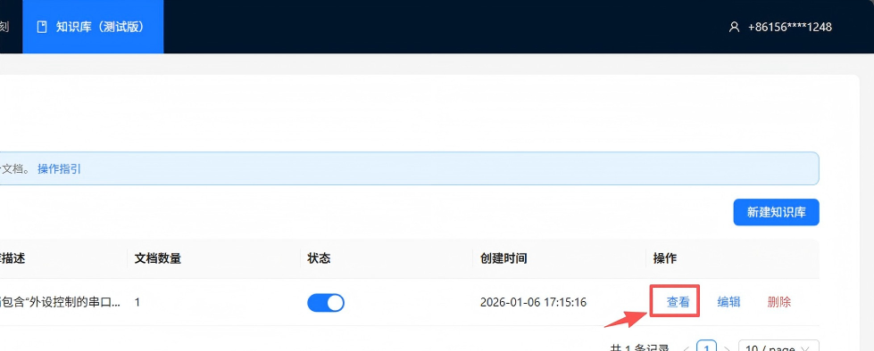
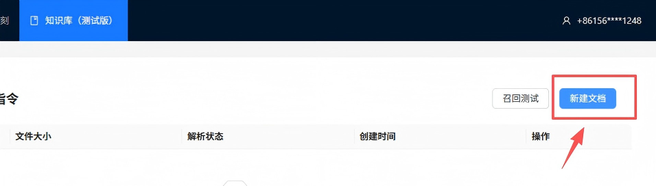
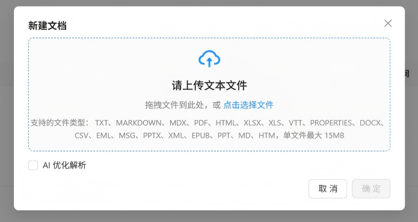
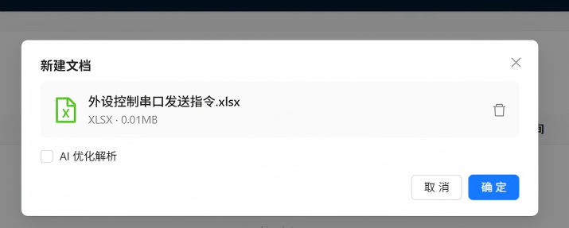
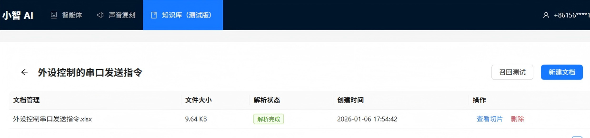

#### 第四步：关联知识库

1. 进入小智后台 "控制台→智能体"模块页面；
2. 选择需要使用的智能体，点击【配置角色】；
3. 在配置角色页面，下拉找到并点击展开【MCP设置】；
4. 在"官方服务"中勾选【知识库】功能；
5. 在下方【知识库配置】列表中，选择刚刚创建的外设控制指令知识库；
6. 点击【保存】，并按提示重启设备，使配置生效。

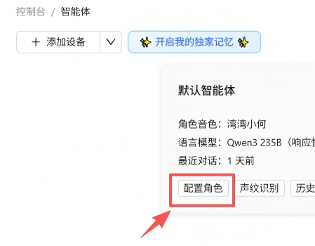
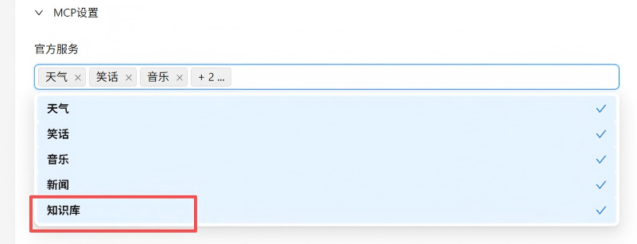
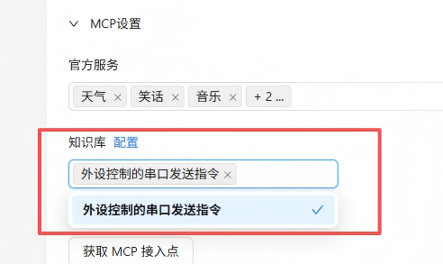

## 安装库
在Arduino IDE中，安装以下库：
- ArduinoJson by Benoit Blanchon

## 软件设计

提供 **串口输出** MCP工具，给到小智AI进行调用，AI识别到控制意图后，AI读取知识库分析后调用MCP工具下发串口输出内容。

**Arduino 示例程序：./resource/ai_vox3_universal_voice_assistant.zip**

> ⚠️**重要提示！**
>
> **注意：** 请修改wifi_config.h中的wifi_ssid和wifi_password，以连接WiFi。
>

打开上面路径的示例程序包并解压zip包（请放在非中文路径下），打开目录，点击 `ai_vox3_universal_voice_assistant.ino` 文件，即可在 Arduino IDE 中打开示例程序。

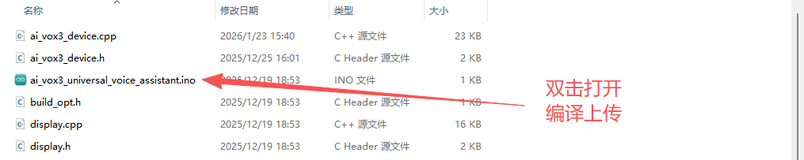

## 源码展示

```cpp
#include <Arduino.h>
#include <ArduinoJson.h>
#include <HardwareSerial.h>

#include "ai_vox3_device.h"
#include "ai_vox_engine.h"

namespace {

HardwareSerial UserSerial(2);

constexpr uint8_t kCustomTxPin = 6;
constexpr uint8_t kCustomRxPin = 5;

/**
 * @brief MCP工具 - 串口输出
 *
 * 该函数注册一个名为 "user.uart_output" 的MCP工具，
 * 用于通过串口发送数据到外部设备。
 *
 * 工具名称: user.uart_output
 * 工具描述: Send data through UART serial port. Use this to control external devices connected via serial port.
 *           Examples:
 *           - To turn on LED: 'turn on led'
 *
 * 参数:
 *   - data (std::string): 要发送的数据
 *     - required: 是
 *     - default_value: 无
 *     - 说明: 要通过串口发送的字符串数据
 *
 * 返回值:
 *   - status: 操作状态 ("success")
 *   - sent_data: 发送的数据内容
 *   - description: 操作描述 ("Data sent through UART serial port successfully")
 */
void McpToolUartOutput() {
  RegisterUserMcpDeclarator([](ai_vox::Engine& engine) {
    engine.AddMcpTool("user.uart_output",
                      "Send data through UART serial port. Use this to control external devices connected via serial port.\n"
                      "Examples:\n"
                      "- To turn on LED: 'turn on led'\n",
                      {{"data",
                        ai_vox::ParamSchema<std::string>{
                            .default_value = std::nullopt,
                        }}});
  });

  RegisterUserMcpHandler("user.uart_output", [](const ai_vox::McpToolCallEvent& event) {
    const auto data_ptr = event.param<std::string>("data");

    if (data_ptr == nullptr) {
      ai_vox::Engine::GetInstance().SendMcpCallError(event.id, "Missing required argument: data");
      return;
    }

    const std::string data = *data_ptr;

    UserSerial.println(String(data.c_str()));
    printf("UART output: %s\n", data.c_str());

    DynamicJsonDocument doc(256);
    doc["status"] = "success";
    doc["sent_data"] = data;
    doc["description"] = "Data sent through UART serial port successfully";

    String jsonString;
    serializeJson(doc, jsonString);

    ai_vox::Engine::GetInstance().SendMcpCallResponse(event.id, jsonString.c_str());
  });
}

}  // namespace

void setup() {
  Serial.begin(115200);
  UserSerial.begin(115200, SERIAL_8N1, kCustomRxPin, kCustomTxPin);
  delay(500);

  McpToolUartOutput();

  InitializeDevice();
}

void loop() {
  ProcessMainLoop();
}
```

## Arduino UNO 使用示例

### 硬件准备

- Arduino uno 开发板

- AI语音助手（已配置好相应知识库）

- LED灯

- SG90舵机

- R300C电机风扇

### 接线

| 模块            | Arduino uno 开发板引脚  |
| --------------- | ------------------ |
| AI-VOX3语音助手TX引脚6  | 12                 |
| AI-VOX3语音助手RX引脚5  | 13                 |
| LED灯           | 3                  |
| SG90舵机        | 4                  |
| R300C电机INA    | 5                  |
| R300C电机INB    | 6                  |

### 程序下载

点击下方链接下载示例程序，下载后解压用Arduino IDE打开示例文件，主板选择Arduino uno。

<a href="https://gh-proxy.com/https://github.com/emakefun-arduino-library/example_tts20_and_speech_recognizer/archive/refs/tags/v1.0.0.zip" download>点击此处下载Arduino UNO端示例程序</a>

### 使用说明

给AI-VOX3语音助手配置好相应知识库后，对着语音助手发出控制外设的指令后，语音助手查询知识库后通过串口发出控制指令（如开灯），Arduino uno接收识别指令成功后，进行相应的外设控制；例如，对着语音助手说，舵机转到150度，指令识别匹配成功后，舵机就会旋转到150度位置。
