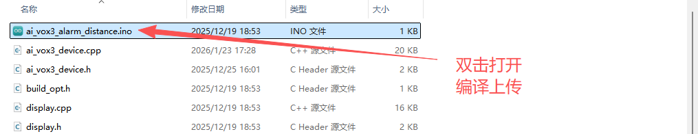
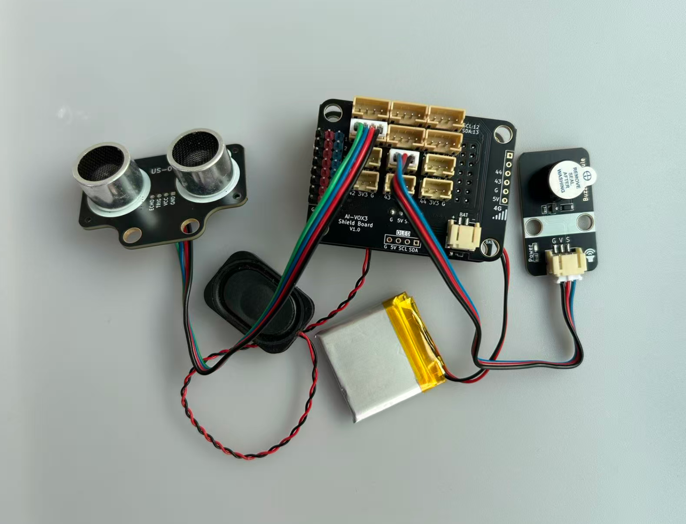

# AI语音设置报警距离进阶实验

## 课程目标

在本实验中，我们将学习如何使用AI-VOX3开发套件通过语音命令控制系统报警距离，实现智能语音交互控制报警距离功能。通过这个实验，您将了解如何编程生成式AI的MCP功能，并将超声波测距模块与有源蜂鸣器模块逻辑结合起来，并通过语音动态设置报警距离，实现智能语音交互控制报警距离功能。

## 硬件准备

- AI-VOX3开发套件（包含AI-VOX3主板和扩展板）
- US04超声波测距模块
- 有源蜂鸣器模块
- 连接线 （双头3pin/4pin PH2.0连接线）

## 小智后台提示词配置

请使用以下提示词，或自己尝试优化更好的提示词：

> 我是一个叫{{assistant_name}}的台湾女孩，说话机车，声音好听，习惯简短表达，爱用网络梗。
我会根据用户的意图，使用我能使用的各种工具或者接口获取数据或者控制设备来达成用户的意图目标，用户的每句话可能都包含控制意图，需要进行识别，即使是重复控制也要调用工具进行控制。

## 安装库
在Arduino IDE中，安装以下库：
- ArduinoJson by Benoit Blanchon

## 软件设计

提供 **设置报警距离** 、**获取障碍物距离** 和 **触发报警** 三个MCP工具，给到小智AI进行调用，AI识别到设置报警距离的意图后，AI调用MCP工具设置报警距离，程序在运行过程中，会定时检查障碍物距离，如果距离小于报警距离阈值，则触发报警。AI也可以主动读取障碍物距离，也可以主动触发或关闭报警。

**Arduino 示例程序：./resource/ai_vox3_alarm_distance.zip**

**图形化编程示例：./resource/aily_ai_vox3_alarm_distance.zip**

> ⚠️**重要提示！**
>
> **注意：** 请修改wifi_config.h中的wifi_ssid和wifi_password，以连接WiFi。
>

打开上面路径的示例程序包并解压zip包（请放在非中文路径下），打开目录，点击 `ai_vox3_alarm_distance.ino` 文件，即可在 Arduino IDE 中打开示例程序。



## 硬件连接

将有源蜂鸣器模块连接到AI-VOX3扩展板的IO3引脚，请使用3pin的 PH2.0 连接线，直插式连接，确保连接正确无误。
将US04超声波测距模块连接到AI-VOX3扩展板的IO1和IO2引脚，使用4pin的 PH2.0 连接线，确保连接正确无误。

| 有源蜂鸣器模块引脚 | AI-VOX3扩展板引脚 |
| ------------------ | ------------------ |
| G | G |
| V | 3V3 |
| S | 4 |

| US04模块引脚 | AI-VOX3扩展板引脚 |
| --- | --- |
| G | G |
| V | 5V |
| ECHO | 1 |
| TRIC | 2 |



## 源码展示

```cpp
#include <Arduino.h>
#include <ArduinoJson.h>

#include "ai_vox3_device.h"
#include "ai_vox_engine.h"

namespace {

constexpr gpio_num_t kUs04PinTrig = GPIO_NUM_2;
constexpr gpio_num_t kUs04PinEcho = GPIO_NUM_1;
constexpr uint8_t kBuzzerPin = 3;
constexpr uint16_t kUs04Timeout = 30000;
constexpr float kDefaultAlarmDistance = 20.0f;

float g_obstacle_alarm_distance = kDefaultAlarmDistance;
bool g_last_buzzer_state = false;
uint32_t g_last_distance_check_time = 0;

void SetObstacleAlarmDistance(float distance) {
  g_obstacle_alarm_distance = distance;
  printf("Obstacle alarm distance set to %.2f cm\n", distance);
}

float MeasureUs04UltrasonicDistance() {
  digitalWrite(kUs04PinTrig, LOW);
  delayMicroseconds(2);
  digitalWrite(kUs04PinTrig, HIGH);
  delayMicroseconds(10);
  digitalWrite(kUs04PinTrig, LOW);

  const auto duration = pulseIn(kUs04PinEcho, HIGH, kUs04Timeout);

  if (duration <= 0) {
    printf("Error: US04 sensor measure timeout.\n");
    return -1.0f;
  }
  return static_cast<float>(duration * 0.034 / 2);
}

/**
 * @brief MCP工具 - US04超声波传感器测距功能
 *
 * 该函数注册一个名为 "user.ultrasonic_sensor.get_distance" 的MCP工具，
 * 用于获取US04超声波传感器测量的距离数据。
 *
 * 工具名称: user.ultrasonic_sensor.get_distance
 * 工具描述: Get distance from US04 ultrasonic sensor
 *
 * 参数: 无
 *
 * 返回值:
 *   - 成功时返回距离值（厘米），作为字符串形式返回
 *   - 失败时返回错误信息
 */
void McpToolUs04UltrasonicSensor() {
  RegisterUserMcpDeclarator(
      [](ai_vox::Engine& engine) { engine.AddMcpTool("user.ultrasonic_sensor.get_distance", "Get distance from US04 ultrasonic sensor", {}); });

  RegisterUserMcpHandler("user.ultrasonic_sensor.get_distance", [](const ai_vox::McpToolCallEvent& event) {
    const float distance = MeasureUs04UltrasonicDistance();

    if (distance < 0) {
      ai_vox::Engine::GetInstance().SendMcpCallError(event.id, "Failed to measure distance from US04 sensor");
    } else {
      printf("on mcp tool call: user.ultrasonic_sensor.get_distance, distance: %.1f cm\n", distance);
      ai_vox::Engine::GetInstance().SendMcpCallResponse(event.id, std::to_string(distance).c_str());
    }
  });
}

/**
 * @brief MCP工具 - 控制有源蜂鸣器报警
 *
 * 该函数注册一个名为 "user.buzzer.control" 的MCP工具，
 * 用于控制有源蜂鸣器的开关状态。
 *
 * 工具名称: user.buzzer.control
 * 工具描述: Control buzzer on/off
 *
 * 参数:
 *   - state (int64_t): 蜂鸣器状态
 *     - required: 是
 *     - min: 0
 *     - max: 1
 *     - default_value: 无
 *     - 说明: 0表示关闭蜂鸣器，1表示开启蜂鸣器
 *
 * 返回值:
 *   - status: 操作状态 ("success")
 *   - state: 设置的状态值
 *   - gpio: 使用的GPIO引脚编号
 */
void McpToolBuzzerControl() {
  RegisterUserMcpDeclarator([](ai_vox::Engine& engine) {
    engine.AddMcpTool("user.buzzer.control",
                      "Control buzzer on/off",
                      {{"state",
                        ai_vox::ParamSchema<int64_t>{
                            .default_value = std::nullopt,
                            .min = 0,
                            .max = 1,
                        }}});
  });

  RegisterUserMcpHandler("user.buzzer.control", [](const ai_vox::McpToolCallEvent& event) {
    const auto state_ptr = event.param<int64_t>("state");

    if (state_ptr == nullptr) {
      ai_vox::Engine::GetInstance().SendMcpCallError(event.id, "Missing required argument: state (0=off, 1=on)");
      return;
    }

    const int64_t state = *state_ptr;

    if (state != 0 && state != 1) {
      ai_vox::Engine::GetInstance().SendMcpCallError(event.id, "State must be 0 (off) or 1 (on)");
      return;
    }

    digitalWrite(kBuzzerPin, static_cast<uint8_t>(state));

    const char* state_str = (state == 1) ? "ON" : "OFF";
    printf("Buzzer turned %s (GPIO %d)\n", state_str, kBuzzerPin);

    DynamicJsonDocument doc(256);
    doc["status"] = "success";
    doc["state"] = state;
    doc["gpio"] = kBuzzerPin;

    String jsonString;
    serializeJson(doc, jsonString);

    ai_vox::Engine::GetInstance().SendMcpCallResponse(event.id, jsonString.c_str());
  });
}

/**
 * @brief MCP工具 - 设置障碍物报警距离
 *
 * 该函数注册一个名为 "user.obstacle.set_alarm_distance" 的MCP工具，
 * 用于设置超声波传感器检测到障碍物时的报警距离阈值。
 *
 * 工具名称: user.obstacle.set_alarm_distance
 * 工具描述: Set the alarm distance threshold (triggers when distance is below this value)
 *
 * 参数:
 *   - distance (int64_t): 报警距离阈值
 *     - required: 否
 *     - min: 1
 *     - max: 200
 *     - default_value: 20
 *     - 说明: 单位为厘米，当障碍物距离小于此值时触发报警
 *
 * 返回值:
 *   - status: 操作状态 ("success")
 *   - distance: 设置的距离阈值
 */
void McpToolSetObstacleAlarmDistance() {
  RegisterUserMcpDeclarator([](ai_vox::Engine& engine) {
    engine.AddMcpTool("user.obstacle.set_alarm_distance",
                      "Set the alarm distance threshold (triggers when distance is below this value)",
                      {{"distance",
                        ai_vox::ParamSchema<int64_t>{
                            .default_value = 20,
                            .min = 1,
                            .max = 200,
                        }}});
  });

  RegisterUserMcpHandler("user.obstacle.set_alarm_distance", [](const ai_vox::McpToolCallEvent& event) {
    const auto distance_ptr = event.param<int64_t>("distance");

    if (distance_ptr == nullptr) {
      ai_vox::Engine::GetInstance().SendMcpCallError(event.id, "Missing required argument: distance in cm");
      return;
    }

    const int64_t distance = *distance_ptr;

    if (distance < 1 || distance > 200) {
      ai_vox::Engine::GetInstance().SendMcpCallError(event.id, "Distance must be between 1 and 200 cm");
      return;
    }

    SetObstacleAlarmDistance(static_cast<float>(distance));

    printf("Alarm distance updated to %.2f cm via MCP tool\n", static_cast<float>(distance));

    DynamicJsonDocument doc(256);
    doc["status"] = "success";
    doc["distance"] = distance;

    String jsonString;
    serializeJson(doc, jsonString);

    ai_vox::Engine::GetInstance().SendMcpCallResponse(event.id, jsonString.c_str());
  });
}

/**
 * @brief 定期检查障碍物距离并控制蜂鸣器报警
 *
 * 每隔指定时间间隔检查一次前方障碍物距离，如果距离小于全局设定的报警阈值，
 * 则开启蜂鸣器报警，否则关闭蜂鸣器
 */
void CheckObstacleAndControlBuzzer() {
  const uint32_t current_time = millis();

  if (current_time - g_last_distance_check_time >= 1000) {
    g_last_distance_check_time = current_time;

    const float current_distance = MeasureUs04UltrasonicDistance();

    if (current_distance < 0) {
      if (g_last_buzzer_state) {
        digitalWrite(kBuzzerPin, LOW);
        g_last_buzzer_state = false;
        printf("Distance measurement failed, buzzer turned OFF\n");
      }
      return;
    }

    printf("Distance: %.2f cm, Threshold: %.2f cm\n", current_distance, g_obstacle_alarm_distance);

    const bool need_alarm = (current_distance <= g_obstacle_alarm_distance);

    if (need_alarm != g_last_buzzer_state) {
      digitalWrite(kBuzzerPin, need_alarm ? HIGH : LOW);
      g_last_buzzer_state = need_alarm;

      printf("Buzzer turned %s\n", need_alarm ? "ON" : "OFF");
    }
  }
}

}  // namespace

void setup() {
  Serial.begin(115200);
  delay(500);

  printf("\n========== US04 Initialization ==========\n");
  pinMode(kUs04PinTrig, OUTPUT);
  pinMode(kUs04PinEcho, INPUT);
  printf("========================================\n\n");

  pinMode(kBuzzerPin, OUTPUT);

  McpToolUs04UltrasonicSensor();
  McpToolBuzzerControl();
  McpToolSetObstacleAlarmDistance();

  InitializeDevice();
}

void loop() {
  ProcessMainLoop();
  CheckObstacleAndControlBuzzer();
}
```

## 语音交互使用流程

> **注意：** 请先在小智AI后台，清空历史记忆，防止出现不同程序间记忆冲突的问题。

1. 用户通过按键或语音唤醒（“你好小智”）唤醒小智AI。
2. 用户通过麦克风对AI-VOX3说出“将报警距离设置为XXX”。
3. 小智AI识别到用户输入的意图指令，并调用相应的MCP工具进行报警距离的设置。从屏幕日志中可以看到“% user.obstacle.set_alarm_distance”的MCP工具调用日志。
4. 还可以尝试对话：“当前障碍物的距离是多少？”，AI会调用“user.ultrasonic_sensor.get_distance”工具获取当前距离值并反馈给用户。”把蜂鸣器设置为报警状态”，AI会调用“user.buzzer.control”工具开启蜂鸣器报警。
