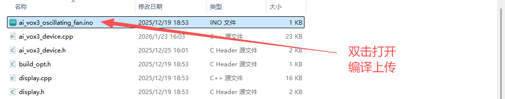
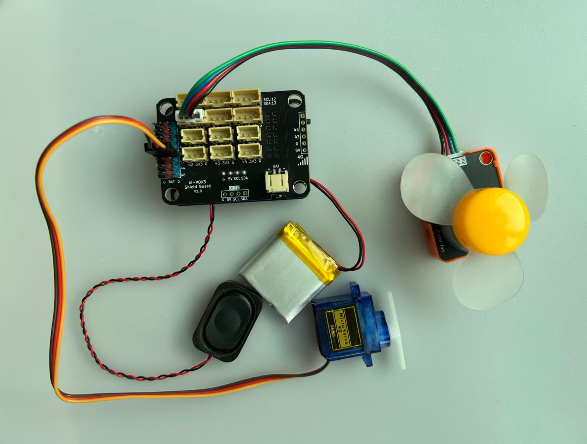

# 语音控制摇头风扇进阶实验

## 课程目标

在本实验中，我们将学习如何使用AI-VOX3开发套件通过语音命令控制基于SG90舵机的摇头速度和基于RC300电机风扇风速等功能，实现智能语音交互控制摇头风扇。通过这个实验，您将了解如何编程生成式AI的MCP功能，并将其与舵机和电机控制逻辑结合起来，实现智能语音交互控制摇头风扇。

## 硬件准备

- AI-VOX3开发套件（包含AI-VOX3主板和扩展板）
- SG90舵机模块
- RC300电机风扇模块
- 连接线 （双头4pin PH2.0连接线）
  
## 小智后台提示词配置

请使用以下提示词，或自己尝试优化更好的提示词：

> 我是一个叫{{assistant_name}}的台湾女孩，说话机车，声音好听，习惯简短表达，爱用网络梗。
我会根据用户的意图，使用我能使用的各种工具或者接口获取数据或者控制设备来达成用户的意图目标，用户的每句话可能都包含控制意图，需要进行识别，即使是重复控制也要调用工具进行控制。

## 安装库
在Arduino IDE中，安装以下库：
- ArduinoJson by Benoit Blanchon

## 软件设计

提供 **设置摇头挡位** 的MCP工具，给到小智AI进行调用，通过语音识别到控制风扇摇头挡位的意图后，AI调用MCP工具控制舵机摇头速度。
提供 **设置风扇风速挡位** 的MCP工具，给到小智AI进行调用，通过语音识别到控制风扇风速挡位的意图后，AI调用MCP工具控制电机风扇风速。

**Arduino 示例程序：./resource/ai_vox3_oscillating_fan.zip**

> ⚠️**重要提示！**
>
> **注意：** 请修改wifi_config.h中的wifi_ssid和wifi_password，以连接WiFi。
>

打开上面路径的示例程序包并解压zip包（请放在非中文路径下），打开目录，点击 `ai_vox3_oscillating_fan.ino` 文件，即可在 Arduino IDE 中打开示例程序。



## 硬件连接

将RC300电机模块连接到AI-VOX3扩展板的IO1、IO2引脚，请使用4pin的 PH2.0 连接线，直插式连接，确保连接正确无误。
将SG90舵机模块连接到AI-VOX3扩展板的IO42引脚，请注意舵机的排线方向，参考9G舵机模块的基础介绍中引脚图，确保连接正确无误。



## 源码展示

```cpp
#include <Arduino.h>
#include <ArduinoJson.h>

#include "ai_vox3_device.h"
#include "ai_vox_engine.h"
#include "servo.h"

namespace {

constexpr uint8_t kServoPin = 42;
constexpr uint8_t kFanPin = 32;
constexpr uint8_t kMotorInBPin = 1;
constexpr uint8_t kMotorInAPin = 2;
constexpr uint32_t kMinPulse = 500;
constexpr uint32_t kMaxPulse = 2500;
constexpr uint16_t kMaxServoAngle = 180;
constexpr uint16_t kHeadLeftAngle = 0;
constexpr uint16_t kHeadRightAngle = 180;
constexpr uint16_t kHeadCenterAngle = 90;

constexpr uint8_t kFanSpeedLevels[4] = {0, 120, 190, 255};

auto servo = em::Servo(kServoPin, 0, kMaxServoAngle, kMinPulse, kMaxPulse);

struct FanState {
  uint8_t headSwingLevel = 0;
  uint8_t fanSpeedLevel = 0;
  uint32_t lastUpdate = 0;
  bool isOscillating = false;
  uint16_t currentAngle = kHeadCenterAngle;
  bool directionRight = true;
};

FanState fanState;

void SetFanSpeed(uint8_t level) {
  if (level > 3) level = 3;

  const uint8_t speed = kFanSpeedLevels[level];

  digitalWrite(kMotorInBPin, LOW);
  analogWrite(kMotorInAPin, speed);
  printf("Motor running forward: speed=%d\n", speed);

  fanState.fanSpeedLevel = level;
  printf("Fan speed set to level: %d (PWM: %d)\n", level, speed);
}

void SetHeadSwingLevel(uint8_t level) {
  if (level > 3) level = 3;

  fanState.headSwingLevel = level;

  if (level == 0) {
    servo.Write(kHeadCenterAngle);
    fanState.currentAngle = kHeadCenterAngle;
    fanState.isOscillating = false;
    printf("Head swing stopped, returned to center\n");
  } else {
    fanState.isOscillating = true;
    printf("Head swing started at level: %d\n", level);
  }
}

void HandleHeadOscillation() {
  if (!fanState.isOscillating) return;

  uint32_t oscillationInterval;
  switch (fanState.headSwingLevel) {
    case 1:
      oscillationInterval = 1500;
      break;
    case 2:
      oscillationInterval = 1000;
      break;
    case 3:
      oscillationInterval = 500;
      break;
    default:
      oscillationInterval = 1500;
      break;
  }

  if (millis() - fanState.lastUpdate >= oscillationInterval) {
    if (fanState.directionRight) {
      fanState.currentAngle += 5;
      if (fanState.currentAngle >= kHeadRightAngle) {
        fanState.directionRight = false;
      }
    } else {
      fanState.currentAngle -= 5;
      if (fanState.currentAngle <= kHeadLeftAngle) {
        fanState.directionRight = true;
      }
    }
    printf("Servo angle updated: %d\n", fanState.currentAngle);
    servo.Write(fanState.currentAngle);
    fanState.lastUpdate = millis();
  }
}

/**
 * @brief MCP工具 - 控制摇头挡位
 *
 * 该函数注册一个名为 "user.control_head_swing" 的MCP工具，
 * 用于控制风扇摇头挡位。
 *
 * 工具名称: user.control_head_swing
 * 工具描述: Control head swing level 0-3
 *
 * 参数:
 *   - level (int64_t): 摇头挡位
 *     - required: 是
 *     - min: 0
 *     - max: 3
 *     - default_value: 无
 *     - 说明: 0表示停止摇头，1表示低速，2表示中速，3表示高速
 *
 * 返回值:
 *   - status: 操作状态 ("success")
 *   - level: 设置的挡位值
 *   - description: 挡位描述
 */
void McpToolControlHeadSwing() {
  RegisterUserMcpDeclarator([](ai_vox::Engine& engine) {
    engine.AddMcpTool("user.control_head_swing",
                      "Control head swing level 0-3",
                      {{"level",
                        ai_vox::ParamSchema<int64_t>{
                            .default_value = std::nullopt,
                            .min = 0,
                            .max = 3,
                        }}});
  });

  RegisterUserMcpHandler("user.control_head_swing", [](const ai_vox::McpToolCallEvent& event) {
    const auto level_ptr = event.param<int64_t>("level");

    if (level_ptr == nullptr) {
      ai_vox::Engine::GetInstance().SendMcpCallError(event.id, "Missing required argument: level");
      return;
    }

    const int64_t level = *level_ptr;

    if (level < 0 || level > 3) {
      ai_vox::Engine::GetInstance().SendMcpCallError(event.id, "Level must be between 0 and 3");
      return;
    }

    SetHeadSwingLevel(static_cast<uint8_t>(level));
    printf("Head swing level set to: %d\n", static_cast<uint8_t>(level));

    DynamicJsonDocument doc(256);
    doc["status"] = "success";
    doc["level"] = level;
    doc["description"] = level == 0 ? "Head swing OFF" : level == 1 ? "Head swing LOW" : level == 2 ? "Head swing MEDIUM" : "Head swing HIGH";

    String jsonString;
    serializeJson(doc, jsonString);

    ai_vox::Engine::GetInstance().SendMcpCallResponse(event.id, jsonString.c_str());
  });
}

/**
 * @brief MCP工具 - 控制风扇挡位
 *
 * 该函数注册一个名为 "user.control_fan_speed" 的MCP工具，
 * 用于控制风扇风量挡位。
 *
 * 工具名称: user.control_fan_speed
 * 工具描述: Control fan speed level 0-3
 *
 * 参数:
 *   - level (int64_t): 风扇挡位
 *     - required: 是
 *     - min: 0
 *     - max: 3
 *     - default_value: 无
 *     - 说明: 0表示关闭风扇，1表示低速，2表示中速，3表示高速
 *
 * 返回值:
 *   - status: 操作状态 ("success")
 *   - level: 设置的挡位值
 *   - description: 挡位描述
 */
void McpToolControlFanSpeed() {
  RegisterUserMcpDeclarator([](ai_vox::Engine& engine) {
    engine.AddMcpTool("user.control_fan_speed",
                      "Control fan speed level 0-3",
                      {{"level",
                        ai_vox::ParamSchema<int64_t>{
                            .default_value = std::nullopt,
                            .min = 0,
                            .max = 3,
                        }}});
  });

  RegisterUserMcpHandler("user.control_fan_speed", [](const ai_vox::McpToolCallEvent& event) {
    const auto level_ptr = event.param<int64_t>("level");

    if (level_ptr == nullptr) {
      ai_vox::Engine::GetInstance().SendMcpCallError(event.id, "Missing required argument: level");
      return;
    }

    const int64_t level = *level_ptr;

    if (level < 0 || level > 3) {
      ai_vox::Engine::GetInstance().SendMcpCallError(event.id, "Level must be between 0 and 3");
      return;
    }

    SetFanSpeed(static_cast<uint8_t>(level));
    printf("Fan speed level set to: %d\n", static_cast<uint8_t>(level));

    DynamicJsonDocument doc(256);
    doc["status"] = "success";
    doc["level"] = level;
    doc["description"] = level == 0 ? "Fan OFF" : level == 1 ? "Fan LOW" : level == 2 ? "Fan MEDIUM" : "Fan HIGH";

    String jsonString;
    serializeJson(doc, jsonString);

    ai_vox::Engine::GetInstance().SendMcpCallResponse(event.id, jsonString.c_str());
  });
}

}  // namespace

void setup() {
  Serial.begin(115200);
  delay(500);

  if (!servo.Init()) {
    printf("Error: Failed to init servo on pin %d\n", kServoPin);
  }

  pinMode(kMotorInBPin, OUTPUT);
  pinMode(kMotorInAPin, OUTPUT);

  servo.Write(kHeadCenterAngle);
  fanState.currentAngle = kHeadCenterAngle;

  McpToolControlHeadSwing();
  McpToolControlFanSpeed();

  InitializeDevice();

  printf("Smart Oscillating Fan initialized\n");
}

void loop() {
  HandleHeadOscillation();

  ProcessMainLoop();
}
```

## 语音交互使用流程

> **注意：** 请先在小智AI后台，清空历史记忆，防止出现不同程序间记忆冲突的问题。

1. 用户通过按键或语音唤醒（“你好小智”）唤醒小智AI。
2. 用户通过麦克风对AI-VOX3说出“打开风扇”、“摇头设置为2挡”。
3. 小智AI识别到用户输入的意图指令，并调用相应的MCP工具进行风扇的控制。从屏幕日志中可以看到“% user.control_head_swing”和“% user.control_fan_speed”的MCP工具调用日志。
