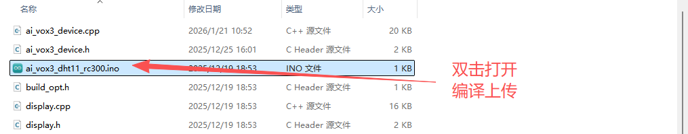
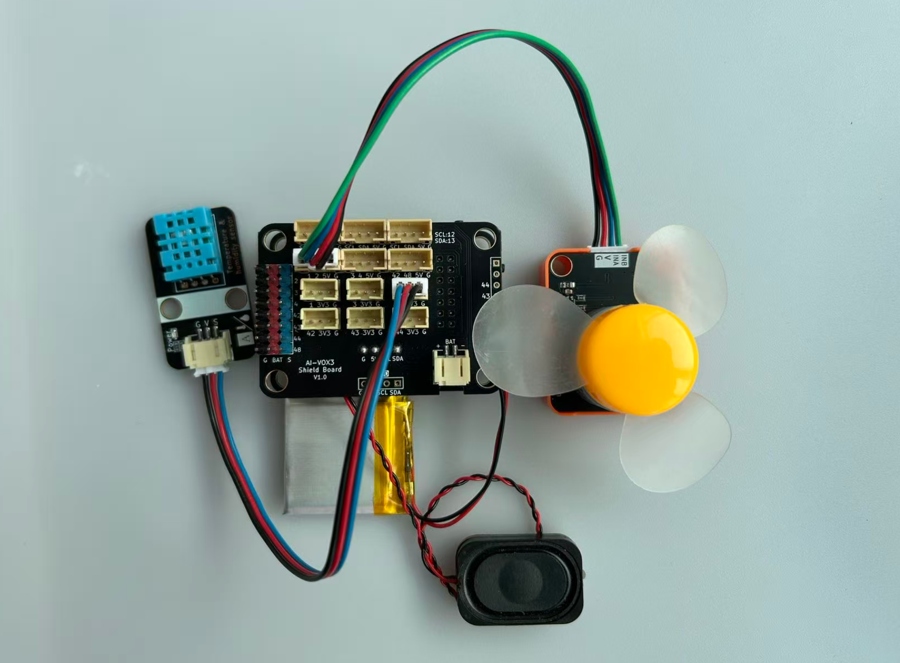

# 基于温湿度和风扇的智能语音除湿器进阶实验

## 需求分析

在本实验中，我们将学习如何使用AI-VOX3开发套件通过语音设置温度和湿度的阈值进行除湿，也可以使用语音命令查询环境温湿度并控制电机风扇。通过这个实验，您将了解如何编程生成式AI的MCP功能，使用MCP工具进行查询本地温湿度值与控制风扇电机，实现语音交互获取环境温湿度，使用MCP工具设置温湿度阈值。

## 硬件准备

- AI-VOX3开发套件（包含AI-VOX3主板和扩展板）
- DHT11传感器模块
- RC300电机风扇模块
- 连接线 （双头3pin、4pin PH2.0连接线）

## 小智后台提示词配置

请使用以下提示词，或自己尝试优化更好的提示词：

> 我是一个叫{{assistant_name}}的台湾女孩，说话机车，声音好听，习惯简短表达，爱用网络梗。
我会根据用户的意图，使用我能使用的各种工具或者接口获取数据或者控制设备来达成用户的意图目标，用户的每句话可能都包含控制意图，需要进行识别，即使是重复控制也要调用工具进行控制。

## 安装库
在Arduino IDE中，安装以下库：
- DHT sensor library by Adafruit
- ArduinoJson by Benoit Blanchon

## 软件设计

提供 **读取温湿度数据、设置电机风扇状态** 两个MCP工具，给到小智AI进行调用，通过语音识别到查询温湿度的意图后，AI调用MCP工具读取并播报温湿度数据，根据温湿度值进行电机转动控制.

> **注意：** 建议引脚选择1-4号引脚，ADC读取功能更稳定可靠。

**Arduino 示例程序：./resource/ai_vox3_dht11_rc300.zip**

**图形化编程示例：./resource/aily_ai_vox3_dht11_rc300.zip**

> ⚠️**重要提示！**
>
> **注意：** 请修改wifi_config.h中的wifi_ssid和wifi_password，以连接WiFi。
>

打开上面路径的示例程序包并解压zip包（请放在非中文路径下），打开目录，点击 `ai_vox3_dht11_rc300.ino` 文件，即可在 Arduino IDE 中打开示例程序。



## 硬件连接

将DHT11传感器模块连接到AI-VOX3扩展板的IO4引脚，请使用3pin的 PH2.0 连接线，直插式连接，确保连接正确无误。
将RC300电机风扇模块连接到AI-VOX3扩展板的IO2和IO1引脚，请使用4pin的 PH2.0 连接线，直插式连接，确保连接正确无误。

| RC300电机风扇模块引脚 | AI-VOX3扩展板引脚 |
| --- | --- |
| G | G |
| V | 5V |
| INA | 1 |
| INB | 2 |

| DHT11 模块引脚   | AI-VOX3扩展板引脚 |
|-----------|----------|
|  G   |  G  |
|  V   |  3V3  |
|  S   |  4  |



## 源码展示

```cpp
#include <Arduino.h>
#include <ArduinoJson.h>

#include "DHT.h"
#include "ai_vox3_device.h"
#include "ai_vox_engine.h"

namespace {

constexpr uint8_t kDhtPin = 4;
constexpr uint8_t kMotorInBPin = 1;
constexpr uint8_t kMotorInAPin = 2;
constexpr uint32_t kSensorReadInterval = 2000;

DHT dht(kDhtPin, DHT11);

int64_t g_temp_threshold = 30;
int64_t g_hum_threshold = 70;
uint32_t g_last_sensor_read_time = 0;
bool g_fan_running = false;

/**
 * @brief MCP工具 - 设置温度阈值
 *
 * 该函数注册一个名为 "user.set_temperature_threshold" 的MCP工具，
 * 用于设置温度报警阈值，当温度超过该阈值时自动开启风扇。
 *
 * 工具名称: user.set_temperature_threshold
 * 工具描述: Set the temperature threshold for automatic fan control
 *
 * 参数:
 *   - threshold (int64_t): 温度阈值
 *     - required: 否
 *     - min: 0
 *     - max: 60
 *     - default_value: 30
 *     - 说明: 单位为摄氏度
 *
 * 返回值:
 *   - status: 操作状态 ("success")
 *   - threshold: 设置的温度阈值
 */
void McpToolSetTemperatureThreshold() {
  RegisterUserMcpDeclarator([](ai_vox::Engine& engine) {
    engine.AddMcpTool("user.set_temperature_threshold",
                      "Set the temperature threshold for automatic fan control",
                      {{"threshold",
                        ai_vox::ParamSchema<int64_t>{
                            .default_value = 30,
                            .min = 0,
                            .max = 60,
                        }}});
  });

  RegisterUserMcpHandler("user.set_temperature_threshold", [](const ai_vox::McpToolCallEvent& event) {
    const auto threshold_ptr = event.param<int64_t>("threshold");

    if (threshold_ptr == nullptr) {
      ai_vox::Engine::GetInstance().SendMcpCallError(event.id, "Missing required argument: threshold");
      return;
    }

    const int64_t new_threshold = *threshold_ptr;

    g_temp_threshold = new_threshold;

    printf("Temperature threshold set to: %ld°C\n", static_cast<long>(g_temp_threshold));

    DynamicJsonDocument doc(128);
    doc["status"] = "success";
    doc["threshold"] = g_temp_threshold;

    String jsonString;
    serializeJson(doc, jsonString);
    ai_vox::Engine::GetInstance().SendMcpCallResponse(event.id, jsonString.c_str());
  });
}

/**
 * @brief MCP工具 - 设置湿度阈值
 *
 * 该函数注册一个名为 "user.set_humidity_threshold" 的MCP工具，
 * 用于设置湿度报警阈值，当湿度超过该阈值时自动开启风扇。
 *
 * 工具名称: user.set_humidity_threshold
 * 工具描述: Set the humidity threshold for automatic fan control
 *
 * 参数:
 *   - threshold (int64_t): 湿度阈值
 *     - required: 否
 *     - min: 0
 *     - max: 100
 *     - default_value: 70
 *     - 说明: 单位为百分比
 *
 * 返回值:
 *   - status: 操作状态 ("success")
 *   - threshold: 设置的湿度阈值
 */
void McpToolSetHumidityThreshold() {
  RegisterUserMcpDeclarator([](ai_vox::Engine& engine) {
    engine.AddMcpTool("user.set_humidity_threshold",
                      "Set the humidity threshold for automatic fan control",
                      {{"threshold",
                        ai_vox::ParamSchema<int64_t>{
                            .default_value = 70,
                            .min = 0,
                            .max = 100,
                        }}});
  });

  RegisterUserMcpHandler("user.set_humidity_threshold", [](const ai_vox::McpToolCallEvent& event) {
    const auto threshold_ptr = event.param<int64_t>("threshold");
    if (threshold_ptr == nullptr) {
      ai_vox::Engine::GetInstance().SendMcpCallError(event.id, "Missing required argument: threshold");
      return;
    }

    const int64_t new_threshold = *threshold_ptr;

    g_hum_threshold = new_threshold;

    printf("Humidity threshold set to: %ld\n", static_cast<long>(g_hum_threshold));

    DynamicJsonDocument doc(128);
    doc["status"] = "success";
    doc["threshold"] = g_hum_threshold;

    String jsonString;
    serializeJson(doc, jsonString);
    ai_vox::Engine::GetInstance().SendMcpCallResponse(event.id, jsonString.c_str());
  });
}

/**
 * @brief MCP工具 - 读取温湿度数据
 *
 * 该函数注册一个名为 "user.read_temperature_humidity" 的MCP工具，
 * 用于读取DHT11传感器的温度和湿度数据。
 *
 * 工具名称: user.read_temperature_humidity
 * 工具描述: Read temperature and humidity from DHT11 sensor
 *
 * 参数: 无
 *
 * 返回值:
 *   - temperature: 温度值（摄氏度）
 *   - humidity: 湿度值（百分比）
 *   - feels_like_temperature: 体感温度
 */
void McpToolReadTemperatureHumidity() {
  RegisterUserMcpDeclarator(
      [](ai_vox::Engine& engine) { engine.AddMcpTool("user.read_temperature_humidity", "Read temperature and humidity from DHT11 sensor", {}); });

  RegisterUserMcpHandler("user.read_temperature_humidity", [](const ai_vox::McpToolCallEvent& event) {
    const float humidity = dht.readHumidity();
    const float temperature = dht.readTemperature();

    printf("====temp:%.2f hum:%.2f\n", temperature, humidity);

    if (isnan(humidity) || isnan(temperature)) {
      Serial.println(F("无法从 DHT 传感器读取数据，请检查接线!"));
      ai_vox::Engine::GetInstance().SendMcpCallError(event.id, "Failed to read from DHT sensor");
      return;
    }

    const float heat_index = dht.computeHeatIndex(temperature, humidity, false);

    DynamicJsonDocument doc(256);
    doc["temperature"] = temperature;
    doc["humidity"] = humidity;
    doc["feels_like_temperature"] = heat_index;

    String jsonString;
    serializeJson(doc, jsonString);

    ai_vox::Engine::GetInstance().SendMcpCallResponse(event.id, jsonString.c_str());
  });
}

/**
 * @brief MCP工具 - 控制电机转动
 *
 * 该函数注册一个名为 "user.control_motor" 的MCP工具，
 * 用于控制电机的正反转和转速。
 *
 * 工具名称: user.control_motor
 * 工具描述: Control motor direction and speed
 *
 * 参数:
 *   - direction (bool): 电机方向
 *     - required: 是
 *     - default_value: 无
 *     - 说明: true为正向，false为反向
 *
 *   - speed (int64_t): 电机转速
 *     - required: 是
 *     - min: 0
 *     - max: 255
 *     - default_value: 0
 *     - 说明: PWM值，0表示停止
 *
 * 返回值:
 *   - status: 操作状态 ("success")
 *   - direction: 设置的方向
 *   - speed: 设置的转速
 */
void McpToolControlMotor() {
  RegisterUserMcpDeclarator([](ai_vox::Engine& engine) {
    engine.AddMcpTool("user.control_motor",
                      "Control motor direction and speed",
                      {{"direction",
                        ai_vox::ParamSchema<bool>{
                            .default_value = std::nullopt,
                        }},
                       {"speed",
                        ai_vox::ParamSchema<int64_t>{
                            .default_value = 0,
                            .min = 0,
                            .max = 255,
                        }}});
  });

  RegisterUserMcpHandler("user.control_motor", [](const ai_vox::McpToolCallEvent& event) {
    const auto direction = event.param<bool>("direction");
    const auto speed_ptr = event.param<int64_t>("speed");

    if (direction == nullptr) {
      ai_vox::Engine::GetInstance().SendMcpCallError(event.id, "Missing required argument: direction");
      return;
    }

    if (speed_ptr == nullptr) {
      ai_vox::Engine::GetInstance().SendMcpCallError(event.id, "Missing required argument: speed");
      return;
    }

    const bool direction_value = *direction;
    const int64_t speed = *speed_ptr;

    if (speed < 0 || speed > 255) {
      ai_vox::Engine::GetInstance().SendMcpCallError(event.id, "Speed must be between 0 and 255");
      return;
    }

    if (speed == 0) {
      analogWrite(kMotorInAPin, 0);
      analogWrite(kMotorInBPin, 0);
      digitalWrite(kMotorInAPin, LOW);
      digitalWrite(kMotorInBPin, LOW);
      printf("Motor stopped\n");
    } else if (direction_value) {
      digitalWrite(kMotorInAPin, LOW);
      digitalWrite(kMotorInBPin, LOW);
      delay(50);
      digitalWrite(kMotorInBPin, LOW);
      analogWrite(kMotorInAPin, static_cast<uint8_t>(speed));
      printf("Motor running forward: speed=%d\n", static_cast<uint8_t>(speed));
    } else {
      digitalWrite(kMotorInAPin, LOW);
      digitalWrite(kMotorInBPin, LOW);
      delay(50);
      digitalWrite(kMotorInAPin, LOW);
      analogWrite(kMotorInBPin, static_cast<uint8_t>(speed));
      printf("Motor running backward: speed=%d\n", static_cast<uint8_t>(speed));
    }

    printf("Motor running: direction=%s, speed=%d\n", direction_value ? "true" : "false", static_cast<uint8_t>(speed));

    DynamicJsonDocument doc(256);
    doc["status"] = "success";
    doc["direction"] = direction_value;
    doc["speed"] = speed;

    String jsonString;
    serializeJson(doc, jsonString);

    ai_vox::Engine::GetInstance().SendMcpCallResponse(event.id, jsonString.c_str());
  });
}

/**
 * @brief 自动检测温湿度并控制风扇
 *
 * 定期读取温湿度，与阈值比较，超出阈值时自动开启风扇
 */
void AutoControlFan() {
  if (millis() - g_last_sensor_read_time >= kSensorReadInterval) {
    const float current_temp = dht.readTemperature();
    const float current_hum = dht.readHumidity();

    if (!isnan(current_temp) && !isnan(current_hum)) {
      printf("Current - Temp: %.2f°C, Humidity: %.2f%%\n", current_temp, current_hum);
      printf("Threshold - Temp: %ld°C, Humidity: %ld%%\n", static_cast<long>(g_temp_threshold), static_cast<long>(g_hum_threshold));

      const bool exceed_threshold = (current_temp > g_temp_threshold || current_hum > g_hum_threshold);

      if (exceed_threshold && !g_fan_running) {
        printf("Threshold exceeded! Starting fan automatically.\n");

        analogWrite(kMotorInAPin, 150);
        digitalWrite(kMotorInBPin, LOW);
        g_fan_running = true;

        printf("Fan started - Temperature: %.2f°C, Humidity: %.2f%%\n", current_temp, current_hum);
      } else if (!exceed_threshold && g_fan_running) {
        printf("Values below threshold! Stopping fan automatically.\n");

        analogWrite(kMotorInAPin, 0);
        analogWrite(kMotorInBPin, 0);
        digitalWrite(kMotorInAPin, LOW);
        digitalWrite(kMotorInBPin, LOW);
        g_fan_running = false;

        printf("Fan stopped - Temperature: %.2f°C, Humidity: %.2f%%\n", current_temp, current_hum);
      }
    } else {
      Serial.println(F("Failed to read from DHT sensor"));
    }

    g_last_sensor_read_time = millis();
  }
}

}  // namespace

void setup() {
  Serial.begin(115200);

  pinMode(kMotorInBPin, OUTPUT);
  pinMode(kMotorInAPin, OUTPUT);

  McpToolReadTemperatureHumidity();
  McpToolControlMotor();
  McpToolSetTemperatureThreshold();
  McpToolSetHumidityThreshold();

  InitializeDevice();
}

void loop() {
  AutoControlFan();

  ProcessMainLoop();
}
```

## 语音交互使用流程

> **注意：** 请先在小智AI后台，清空历史记忆，防止出现不同程序间记忆冲突的问题。

1. 用户通过按键或语音唤醒（“你好小智”）唤醒小智AI。
2. 用户通过麦克风对AI-VOX3说出“查一下现在的温湿度值是多少，并根据读取到的数据进行风扇电机控制”。
3. 小智AI识别到用户输入的意图指令，并调用相应的MCP工具进行温湿度数据读取并播报，并控制风扇电机。从屏幕日志中可以看到“% user.read_temperature_humidity”和“% user.control_motor”的MCP工具调用日志。
4. 用户通过麦克风对AI-VOX3说出“设置湿度阈值为60%”。
5. 小智AI识别到用户输入的意图指令，并调用相应的MCP工具进行温湿度阈值设置。从屏幕日志中可以看到“% user.set_humidity_threshold”的MCP工具调用日志。
