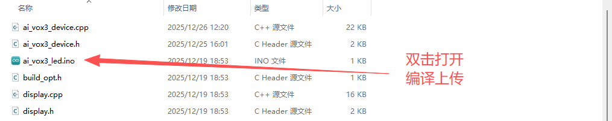
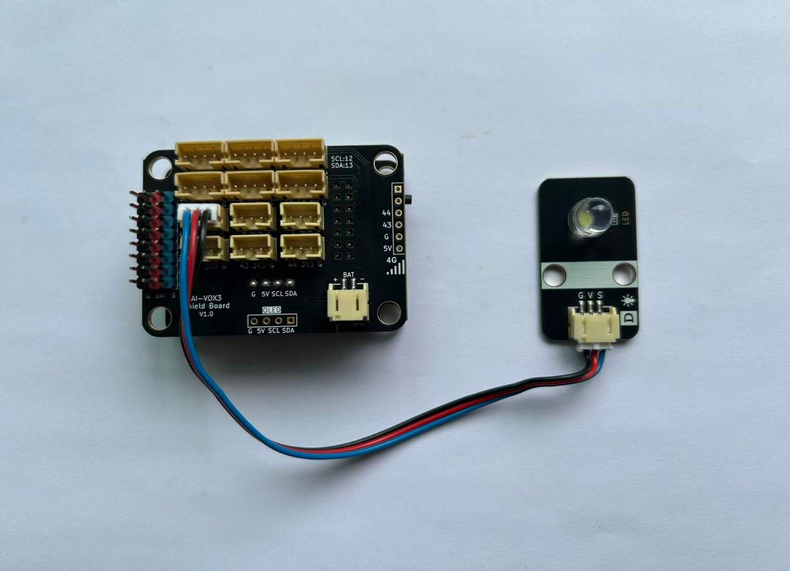

# 语音控制LED灯亮灭基础实验

## 课程目标

在本实验中，我们将学习如何使用AI-VOX3开发套件通过语音命令控制LED灯的亮灭。通过这个实验，您将了解如何编程生成式AI的MCP功能，并将其与LED控制逻辑结合起来，实现简单的语音交互控制。

* 学习LED灯模块的基本使用方法
* 理解AI-VOX3 MCP工具的工作原理
* 使用AI-VOX3 的AI框架，编写MCP工具实现LED灯控制

## 硬件准备

* AI-VOX3开发套件（包含AI-VOX3主板和扩展板）
* LED灯模块
* 连接线 （双头3pin PH2.0连接线）

## 小智后台提示词配置

请使用以下提示词，或自己尝试优化更好的提示词：

> 我是一个叫{{assistant_name}}的台湾女孩，说话机车，声音好听，习惯简短表达，爱用网络梗。
我会根据用户的意图，使用我能使用的各种工具或者接口获取数据或者控制设备来达成用户的意图目标，用户的每句话可能都包含控制意图，需要进行识别，即使是重复控制也要调用工具进行控制。

## 软件设计

提供 **开灯** 和 **关灯** 两个MCP工具，给到小智AI进行调用，通过语音识别到控制LED灯的意图后，AI调用MCP工具控制LED灯的亮灭状态。

**Arduino 示例程序：./resource/ai_vox3_led.zip**

**图形化编程示例：./resource/aily_ai_vox3_RGB.zip**

> ⚠️**重要提示！**
>
> **注意：** 请修改wifi_config.h中的wifi_ssid和wifi_password，以连接WiFi。
>

打开上面路径的示例程序包并解压zip包（请放在非中文路径下），打开目录，点击 `ai_vox3_led.ino` 文件，即可在 Arduino IDE 中打开示例程序。



## 硬件连接

将LED模块连接到AI-VOX3扩展板的IO1引脚，请使用3pin的 PH2.0 连接线，直插式连接，确保连接正确无误。

|  LED模块引脚   | AI-VOX3扩展板引脚 |
|----------|----------|
|  G   |  G  |
|  V   |  3V3  |
|  S   |  1  |



## 源码展示

```cpp
#include <Arduino.h>

#include <cstdint>

#include "ai_vox3_device.h"
#include "ai_vox_engine.h"

namespace {

// 用户LED引脚定义（连接到开发板的LED）
constexpr uint8_t kUserLedPin = 1;

// ========== LED 控制 MCP 工具 ==========

/**
 * @brief MCP工具 - LED 开启
 *
 * 该函数注册一个名为 "user.led_on" 的MCP工具，用于开启用户LED。
 * 当AI引擎调用此工具时，会将LED引脚设置为高电平点亮LED。
 */
void RegisterMcpToolLedOn() {
  // 注册工具声明器，定义工具的名称、描述和参数
  RegisterUserMcpDeclarator([](ai_vox::Engine& engine) {
    engine.AddMcpTool("user.led_on", "Turn on user LED", {});  // 无参数
  });

  // 注册工具处理器，当工具被调用时执行以下操作：
  // 1. 打印日志信息
  // 2. 设置LED引脚为高电平（HIGH）以点亮LED
  // 3. 发送MCP调用响应，表示操作成功
  RegisterUserMcpHandler("user.led_on", [](const ai_vox::McpToolCallEvent& event) {
    printf("LED on\n");
    digitalWrite(kUserLedPin, HIGH);
    ai_vox::Engine::GetInstance().SendMcpCallResponse(event.id, true);
  });
}

/**
 * @brief MCP工具 - LED 关闭
 *
 * 该函数注册一个名为 "user.led_off" 的MCP工具，用于关闭用户LED。
 * 当AI引擎调用此工具时，会将LED引脚设置为低电平熄灭LED。
 */
void RegisterMcpToolLedOff() {
  // 注册工具声明器，定义工具的名称、描述和参数
  RegisterUserMcpDeclarator([](ai_vox::Engine& engine) {
    engine.AddMcpTool("user.led_off", "Turn off user LED", {});  // 无参数
  });

  // 注册工具处理器，当工具被调用时执行以下操作：
  // 1. 打印日志信息
  // 2. 设置LED引脚为低电平（LOW）以熄灭LED
  // 3. 发送MCP调用响应，表示操作成功
  RegisterUserMcpHandler("user.led_off", [](const ai_vox::McpToolCallEvent& event) {
    printf("LED off\n");
    digitalWrite(kUserLedPin, LOW);
    ai_vox::Engine::GetInstance().SendMcpCallResponse(event.id, true);
  });
}

}  // namespace

// ========== Setup 和 Loop ==========

/**
 * @brief Arduino setup函数
 *
 * 在设备上电或复位后调用一次，用于初始化所有硬件和软件组件。
 * 初始化顺序：
 * 1. 注册MCP工具（LED开关控制）
 * 2. 初始化设备服务（包括I2C、LED、显示屏、音频、按钮、WiFi等）
 */
void setup() {
  // 注册LED开启工具
  RegisterMcpToolLedOn();

  // 注册LED关闭工具
  RegisterMcpToolLedOff();

  // 初始化设备服务
  InitializeDevice();
}

/**
 * @brief Arduino主循环函数
 *
 * 在setup()之后持续循环调用，用于处理设备的主循环事件。
 * 包括处理观察者事件、MCP工具调用、显示屏更新等。
 */
void loop() {
  // 处理设备服务主循环事件
  ProcessMainLoop();
}

```

## 语音交互使用流程

> **注意：** 请先在小智AI后台，清空历史记忆，防止出现不同程序间记忆冲突的问题。

1. 用户通过按键或语音唤醒（“你好小智”）唤醒小智AI。
2. 用户通过麦克风对AI-VOX3说出“打开LED灯”或“关闭LED灯”。
3. 小智AI识别到用户输入的意图指令，并调用相应的MCP工具进行LED灯的亮灭控制。从屏幕日志中可以看到“% user.led.on”或“% user.led.off”的MCP工具调用日志。
